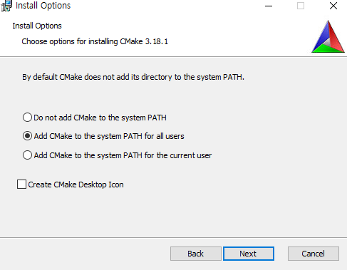

```{r setup, include=FALSE}
knitr::opts_chunk$set(echo = TRUE)
```

## 개요 
- gbm 계열의 알고리즘이 발전하면서 `Kaggle` 대회에서 좋은 성과를 거두고 있다. 
- 대표적인 GBM 머신러닝 알고리즘 계열인 `LightGBM`을 설치해본다. 

### why LightGBM?
- LightGBM은 최근 들어 각 기업에서도 실제 서비스에 응용하기 위한 머신러닝 알고리즘으로 채택하기 시작했다. 
  + 사례: [데이터분석가로서 업무 과정과 경험, 배움을 공유합니다, 3.1 장 참조](https://woowabros.github.io/woowabros/2020/07/01/how_data_analyst_works.html)
- 가장 큰 특징 중 하나는 기존 연산속도가 길었던 GBM 계열의 다른 알고리즘보다 빠르다는 장점이 있다. 
- 자세한 내용은 공식 문서를 참조한다. 
  + [Welcome to LightGBM’s documentation!](https://lightgbm.readthedocs.io/en/latest/)
  
## I. 주요 프로그램 설치
- 설치가이드는 R API 문서를 통해 확인한다. 
- 국내 대다수의 유저가 `Windows + RStudio` 인 것을 감안하여 설치 프로세스를 진행하도록 한다. 
  + 공식문서에 잘 나와 있지만, 각자의 OS 환경이 다 다르기 때문에 필자의 접근 방법만 참고하였으면 좋겠다. 
- [설치가이드 공식 문서](https://lightgbm.readthedocs.io/en/latest/Installation-Guide.html)에는 크게 3가지 버전이 있다. 
  + With GUI: visual studio에서 진행한다. 
  + From Command Line: git, CMake, VS Build Tools가 필요하다. 
  + MinGW-w64: git, Cmake, MinGW-w64 버전이 필요하다.
  + 이 중에서 필자는 `From Command Line` 버전으로 진행하였다. 
  
### (1) From Command Line
- 깃설치: https://git-scm.com/download/win 
- `CMake`설치: [CMake](https://cmake.org/) (3.18.1 or higher) 버전 설치가 필요하다. 
- [VS Build Tools](https://visualstudio.microsoft.com/downloads/) 설치를 진행한다. 
  + 만약 기존에 `Visual Studio` IDE가 존재하면 설치팔 필요는 없다. 
- 깃설치는 간단하기 때문에 본 포스트는 생략한다. 

### (2) CMake
- `CMake` 설치는 다운로드 페이지에서 진행한다. 
  + [다운로드 페이지](https://cmake.org/download/)
  + 이 때, `cmake-3.18.1-win64-x64.msi` 파일을 찾아서 설치하는 것을 권한다.
  + 이 때, 중간에 `Path`를 아래 그림과 같이 꼭 같이 지정해야줘야 한다. 
  


### (3) Visual Studio Code 설치
- 이제 Visual Studio 코드 설치를 진행한다. 
  + 설치: [VS Build Tools](https://visualstudio.microsoft.com/downloads/) 설치를 진행한다. 
  
### (4) Rtools40 설치
- Rtools 설치가 필요하다. 
  + 설치파일: [Using Rtools40 on Windows](https://cran.r-project.org/bin/windows/Rtools/)
  + R 4.0.0 이후부터는 windows에서는 환경세팅이 조금 다르다. 
  따라서, 위에서 별도로 설치하는 것을 권장한다. 

```
R version 4.0.2 (2020-06-22)
Platform: x86_64-w64-mingw32/x64 (64-bit)
Running under: Windows 10 x64 (build 17763)
```

- 설치가 끝나면 R 콘솔창에서 아래와 같이 실행한다. 
```r
> writeLines('PATH="${RTOOLS40_HOME}\\usr\\bin;${PATH}"', con = "~/.Renviron")
```
- 환경설정을 직접 설정할 수도 있다. 
  + 
- 그리고, 새로운 세션을 열어서 아래와 같이 확인해본다.(Restart R) 

```r
> Sys.which("make")
## "C:\\rtools40\\usr\\bin\\make.exe"
```

- 만약 실제적으로 `make`로 실행되는지 확인해보자. 
```r
install.packages("jsonlite", type = "source")
```

- 정상적으로 설치가 되었다면 `RTools` 는 정상적으로 설치가 된 것으로 볼 수 있다. 

## II. Package 설치
- 이제 패키지를 설치해본다. 
- 이 때, 주의해야 할 점이 있다. 공식문서에서 패키지를 설치할 때 `visual studio code` 에서 작성하는 것을 권장한다. 

> Windows Toolchain Options
A "toolchain" refers to the collection of software used to build the library. The R package can be built with three different toolchains.`Warning for Windows users: it is recommended to use Visual Studio for its better multi-threading efficiency in Windows for many core systems.` For very simple systems (dual core computers or worse), MinGW64 is recommended for maximum performance. If you do not know what to choose, `it is recommended to use Visual Studio, the default compiler.` Do not try using MinGW in Windows on many core systems. It may result in 10x slower results than Visual Studio.

- 현재 `RStudio`에서 작업하고 있다면, 일단 종료를 한다. 
