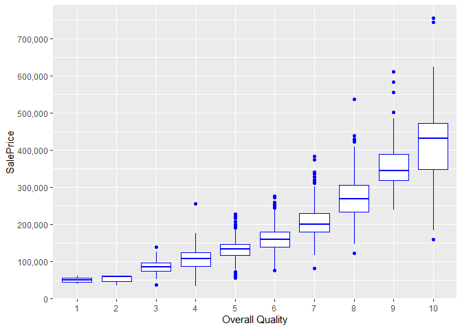
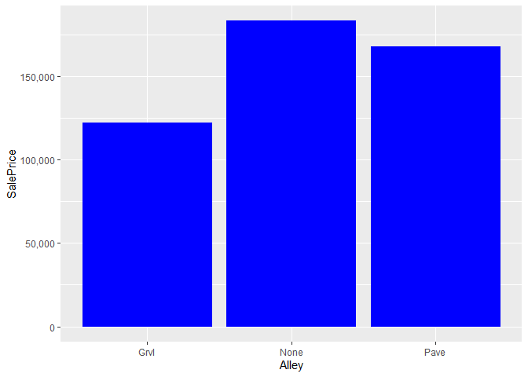
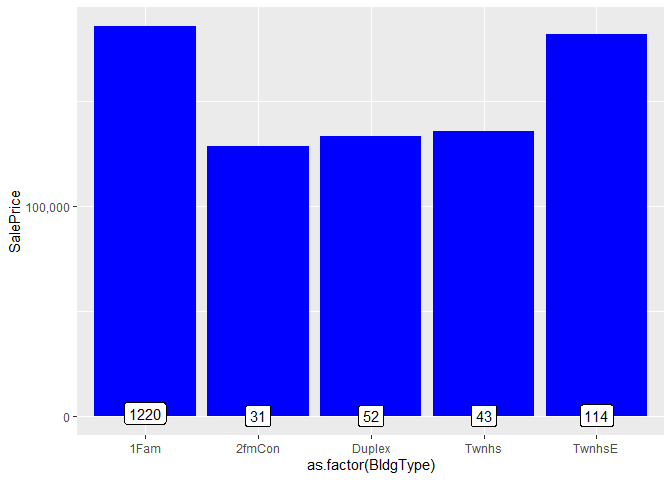

#Executive Summary

I started this competition by just focusing on getting a good understanding of the dataset. The EDA is detailed and many visualizations are included. This version also includes modeling. 

* Lasso regressions performs best with a cross validation RMSE-score of 0.1121. Given the fact that there is a lot of multicolinearity among the variables, this was expected. Lasso does not select a substantial number of the available variables in its model, as it is supposed to do.
* The XGBoost model also performs very well with a cross validation RMSE of 0.1162. 
* As those two algorithms are very different, averaging predictions is likely to improve the predictions. As the Lasso cross validated RMSE is better than XGBoost's CV score, I decided to weight the Lasso results double.

#Introduction

Kaggle describes this competition as [follows](https://www.kaggle.com/c/house-prices-advanced-regression-techniques):

Ask a home buyer to describe their dream house, and they probably won't begin with the height of the basement ceiling or the proximity to an east-west railroad. But this playground competition's dataset proves that much more influences price negotiations than the number of bedrooms or a white-picket fence.

With 79 explanatory variables describing (almost) every aspect of residential homes in Ames, Iowa, this competition challenges you to predict the final price of each home.


<center></center>

# Loading and Exploring Data

##Loading libraries required and reading the data into R

Loading R packages used besides base R.


```r
library(knitr)
library(ggplot2)
library(plyr)
library(dplyr)
library(corrplot)
library(caret)
library(gridExtra)
library(scales)
library(Rmisc)
library(ggrepel)
library(randomForest)
library(psych)
library(xgboost)
```

Below, I am reading the csv's as dataframes into R.


```r
train <- read.csv("train.csv", stringsAsFactors = F)
test <- read.csv("test.csv", stringsAsFactors = F)
```

##Data size and structure

The train dataset consist of character and integer variables. Most of the character variables are actually (ordinal) factors, but I chose to read them into R as character strings as most of them require cleaning and/or feature engineering first. In total, there are 81 columns/variables, of which the last one is the response variable (SalePrice). Below, I am displaying only a glimpse of the variables. All of them are discussed in more detail throughout the document.


```r
dim(train)
```

```
## [1] 1460   81
```

```r
str(train[,c(1:10, 81)]) #display first 10 variables and the response variable
```

```
## 'data.frame':	1460 obs. of  11 variables:
##  $ Id         : int  1 2 3 4 5 6 7 8 9 10 ...
##  $ MSSubClass : int  60 20 60 70 60 50 20 60 50 190 ...
##  $ MSZoning   : chr  "RL" "RL" "RL" "RL" ...
##  $ LotFrontage: int  65 80 68 60 84 85 75 NA 51 50 ...
##  $ LotArea    : int  8450 9600 11250 9550 14260 14115 10084 10382 6120 7420 ...
##  $ Street     : chr  "Pave" "Pave" "Pave" "Pave" ...
##  $ Alley      : chr  NA NA NA NA ...
##  $ LotShape   : chr  "Reg" "Reg" "IR1" "IR1" ...
##  $ LandContour: chr  "Lvl" "Lvl" "Lvl" "Lvl" ...
##  $ Utilities  : chr  "AllPub" "AllPub" "AllPub" "AllPub" ...
##  $ SalePrice  : int  208500 181500 223500 140000 250000 143000 307000 200000 129900 118000 ...
```


```r
#Getting rid of the IDs but keeping the test IDs in a vector. These are needed to compose the submission file
test_labels <- test$Id
test$Id <- NULL
train$Id <- NULL
```


```r
test$SalePrice <- NA
all <- rbind(train, test)
dim(all)
```

```
## [1] 2919   80
```

Without the Id's, the dataframe consists of 79 predictors and our response variable SalePrice.

#Exploring some of the most important variables

##The response variable; SalePrice

As you can see, the sale prices are right skewed. This was expected as few people can afford very expensive houses. I will keep this in mind, and take measures before modeling.


```r
ggplot(data=all[!is.na(all$SalePrice),], aes(x=SalePrice)) +
        geom_histogram(fill="blue", binwidth = 10000) +
        scale_x_continuous(breaks= seq(0, 800000, by=100000), labels = comma)
```

<!-- -->


```r
summary(all$SalePrice)
```

```
##    Min. 1st Qu.  Median    Mean 3rd Qu.    Max.    NA's 
##   34900  129975  163000  180921  214000  755000    1459
```


##The most important numeric predictors

The character variables need some work before I can use them. To get a feel for the dataset, I decided to first see which numeric variables have a high correlation with the SalePrice.

###Correlations with SalePrice

Altogether, there are 10 numeric variables with a correlation of at least 0.5 with SalePrice. All those correlations are positive.


```r
numericVars <- which(sapply(all, is.numeric)) #index vector numeric variables
numericVarNames <- names(numericVars) #saving names vector for use later on
cat('There are', length(numericVars), 'numeric variables')
```

```
## There are 37 numeric variables
```

```r
all_numVar <- all[, numericVars]
cor_numVar <- cor(all_numVar, use="pairwise.complete.obs") #correlations of all numeric variables

#sort on decreasing correlations with SalePrice
cor_sorted <- as.matrix(sort(cor_numVar[,'SalePrice'], decreasing = TRUE))
 #select only high corelations
CorHigh <- names(which(apply(cor_sorted, 1, function(x) abs(x)>0.5)))
cor_numVar <- cor_numVar[CorHigh, CorHigh]

corrplot.mixed(cor_numVar, tl.col="black", tl.pos = "lt")
```

<!-- -->

In the remainder of this section, I will visualize the relation between SalePrice and the two predictors with the highest correlation with SalePrice; Overall Quality and the 'Above Grade' Living Area (this is the proportion of the house that is not in a basement; [link](http://www.gimme-shelter.com/above-grade-50066/)).

It also becomes clear the multicollinearity is an issue. For example: the correlation between GarageCars and GarageArea is very high (0.89), and both have similar (high) correlations with SalePrice. The other 6 six variables with a correlation higher than 0.5 with SalePrice are:
-TotalBsmtSF: Total square feet of basement area
-1stFlrSF: First Floor square feet
-FullBath: Full bathrooms above grade
-TotRmsAbvGrd: Total rooms above grade (does not include bathrooms)
-YearBuilt: Original construction date
-YearRemodAdd: Remodel date (same as construction date if no remodeling or additions)


###Overall Quality

Overall Quality has the highest correlation with SalePrice among the numeric variables (0.79). It rates the overall material and finish of the house on a scale from 1 (very poor) to 10 (very excellent).


```r
ggplot(data=all[!is.na(all$SalePrice),], aes(x=factor(OverallQual), y=SalePrice))+
        geom_boxplot(col='blue') + labs(x='Overall Quality') +
        scale_y_continuous(breaks= seq(0, 800000, by=100000), labels = comma)
```

<!-- -->

The positive correlation is certainly there indeed, and seems to be a slightly upward curve. Regarding outliers, I do not see any extreme values. If there is a candidate to take out as an outlier later on, it seems to be the expensive house with grade 4.

###Above Grade (Ground) Living Area (square feet)

The numeric variable with the second highest correlation with SalesPrice is the Above Grade Living Area. This make a lot of sense; big houses are generally more expensive.


```r
ggplot(data=all[!is.na(all$SalePrice),], aes(x=GrLivArea, y=SalePrice))+
        geom_point(col='blue') + geom_smooth(method = "lm", se=FALSE, color="black", aes(group=1)) +
        scale_y_continuous(breaks= seq(0, 800000, by=100000), labels = comma) +
        geom_text_repel(aes(label = ifelse(all$GrLivArea[!is.na(all$SalePrice)]>4500, rownames(all), '')))
```

```
## `geom_smooth()` using formula 'y ~ x'
```

<!-- -->

Especially the two houses with really big living areas and low SalePrices seem outliers (houses 524 and 1299, see labels in graph). I will not take them out yet, as taking outliers can be dangerous. For instance, a low score on the Overall Quality could explain a low price. However, as you can see below, these two houses actually also score maximum points on Overall Quality. Therefore, I will keep houses 1299 and 524 in mind as prime candidates to take out as outliers.


```r
all[c(524, 1299), c('SalePrice', 'GrLivArea', 'OverallQual')]
```

```
##      SalePrice GrLivArea OverallQual
## 524     184750      4676          10
## 1299    160000      5642          10
```

#Missing data, label encoding, and factorizing variables

##Completeness of the data

First of all, I would like to see which variables contain missing values.


```r
NAcol <- which(colSums(is.na(all)) > 0)
sort(colSums(sapply(all[NAcol], is.na)), decreasing = TRUE)
```

```
##       PoolQC  MiscFeature        Alley        Fence    SalePrice  FireplaceQu 
##         2909         2814         2721         2348         1459         1420 
##  LotFrontage  GarageYrBlt GarageFinish   GarageQual   GarageCond   GarageType 
##          486          159          159          159          159          157 
##     BsmtCond BsmtExposure     BsmtQual BsmtFinType2 BsmtFinType1   MasVnrType 
##           82           82           81           80           79           24 
##   MasVnrArea     MSZoning    Utilities BsmtFullBath BsmtHalfBath   Functional 
##           23            4            2            2            2            2 
##  Exterior1st  Exterior2nd   BsmtFinSF1   BsmtFinSF2    BsmtUnfSF  TotalBsmtSF 
##            1            1            1            1            1            1 
##   Electrical  KitchenQual   GarageCars   GarageArea     SaleType 
##            1            1            1            1            1
```

```r
cat('There are', length(NAcol), 'columns with missing values')
```

```
## There are 35 columns with missing values
```

Of course, the 1459 NAs in SalePrice match the size of the test set perfectly. This means that I have to fix NAs in 34 predictor variables.

##Imputing missing data {.tabset}

In this section, I am going to fix the 34 predictors that contains missing values. I will go through them working my way down from most NAs until I have fixed them all. If I stumble upon a variable that actually forms a group with other variables, I will also deal with them as a group. For instance, there are multiple variables that relate to Pool, Garage, and Basement.

As I want to keep the document as readable as possible, I decided to use the "Tabs" option that knitr provides. You can find a short analysis for each (group of) variables under each Tab. You don't have to go through all sections, and can also just have a look at a few tabs. If you do so, I think that especially the Garage and Basement sections are worthwhile, as I have been carefull in determing which houses really do not have a basement or garage.

Besides making sure that the NAs are taken care off, I have also converted character variables into ordinal integers if there is clear ordinality, or into factors if levels are categories without ordinality. I will convert these factors into numeric later on by using one-hot encoding (using the model.matrix function).

###Pool variables

**Pool Quality and the PoolArea variable**

The PoolQC is the variable with most NAs. The description is as follows:

PoolQC: Pool quality
		
       Ex	Excellent
       Gd	Good
       TA	Average/Typical
       Fa	Fair
       NA	No Pool
       
So, it is obvious that I need to just assign 'No Pool' to the NAs. Also, the high number of NAs makes sense as normally only a small proportion of houses have a pool.


```r
all$PoolQC[is.na(all$PoolQC)] <- 'None'
```

It is also clear that I can label encode this variable as the values are ordinal. As there a multiple variables that use the same quality levels, I am going to create a vector that I can reuse later on.


```r
Qualities <- c('None' = 0, 'Po' = 1, 'Fa' = 2, 'TA' = 3, 'Gd' = 4, 'Ex' = 5)
```

Now, I can use the function 'revalue' to do the work for me.


```r
all$PoolQC<-as.integer(revalue(all$PoolQC, Qualities))
table(all$PoolQC)
```

```
## 
##    0    2    4    5 
## 2909    2    4    4
```

However, there is a second variable that relates to Pools. This is the PoolArea variable (in square feet). As you can see below, there are 3 houses without PoolQC. First, I checked if there was a clear relation between the PoolArea and the PoolQC. As I did not see a clear relation (bigger of smaller pools with better PoolQC), I am going to impute PoolQC values based on the Overall Quality of the houses (which is not very high for those 3 houses).


```r
all[all$PoolArea > 0 & all$PoolQC==0, c('PoolArea', 'PoolQC', 'OverallQual')]
```

```
##      PoolArea PoolQC OverallQual
## 2421      368      0           4
## 2504      444      0           6
## 2600      561      0           3
```

```r
all$PoolQC[2421] <- 2
all$PoolQC[2504] <- 3
all$PoolQC[2600] <- 2
```

**Please return to the 5.2 Tabs menu to select other (groups of) variables**

###Miscellaneous Feature

**Miscellaneous feature not covered in other categories**

Within Miscellaneous Feature, there are 2814 NAs. As the values are not ordinal, I will convert MiscFeature into a factor. Values:	

       Elev	Elevator
       Gar2	2nd Garage (if not described in garage section)
       Othr	Other
       Shed	Shed (over 100 SF)
       TenC	Tennis Court
       NA	None


```r
all$MiscFeature[is.na(all$MiscFeature)] <- 'None'
all$MiscFeature <- as.factor(all$MiscFeature)

ggplot(all[!is.na(all$SalePrice),], aes(x=MiscFeature, y=SalePrice)) +
        geom_bar(stat='summary', fun.y = "median", fill='blue') +
        scale_y_continuous(breaks= seq(0, 800000, by=100000), labels = comma) +
        geom_label(stat = "count", aes(label = ..count.., y = ..count..))
```

```
## Warning: Ignoring unknown parameters: fun.y
```

```
## No summary function supplied, defaulting to `mean_se()`
```

<!-- -->

```r
table(all$MiscFeature)
```

```
## 
## Gar2 None Othr Shed TenC 
##    5 2814    4   95    1
```

When looking at the frequencies, the variable seems irrelevant to me. Having a shed probably means 'no Garage', which would explain the lower sales price for Shed. Also, while it makes a lot of sense that a house with a Tennis court is expensive, there is only one house with a tennis court in the training set.

**Please return to the 5.2 Tabs menu to select other (groups of) variables**

###Alley

**Type of alley access to property**

Within Alley, there are 2721 NAs. As the values are not ordinal, I will convert Alley into a factor. Values:

       Grvl	Gravel
       Pave	Paved
       NA 	No alley access


```r
all$Alley[is.na(all$Alley)] <- 'None'
all$Alley <- as.factor(all$Alley)

ggplot(all[!is.na(all$SalePrice),], aes(x=Alley, y=SalePrice)) +
        geom_bar(stat='summary', fun.y = "median", fill='blue')+
        scale_y_continuous(breaks= seq(0, 200000, by=50000), labels = comma)
```

```
## Warning: Ignoring unknown parameters: fun.y
```

```
## No summary function supplied, defaulting to `mean_se()`
```

<!-- -->

```r
table(all$Alley)
```

```
## 
## Grvl None Pave 
##  120 2721   78
```

**Please return to the 5.2 Tabs menu to select other (groups of) variables**

###Fence

**Fence quality**

Within Fence, there are 2348 NAs. The values seem to be ordinal. Values:

       GdPrv	Good Privacy
       MnPrv	Minimum Privacy
       GdWo	Good Wood
       MnWw	Minimum Wood/Wire
       NA	No Fence


```r
all$Fence[is.na(all$Fence)] <- 'None'
table(all$Fence)
```

```
## 
## GdPrv  GdWo MnPrv  MnWw  None 
##   118   112   329    12  2348
```

```r
all[!is.na(all$SalePrice),] %>% group_by(Fence) %>% summarise(median = median(SalePrice), counts=n())
```

```
## # A tibble: 5 x 3
##   Fence median counts
##   <chr>  <dbl>  <int>
## 1 GdPrv 167500     59
## 2 GdWo  138750     54
## 3 MnPrv 137450    157
## 4 MnWw  130000     11
## 5 None  173000   1179
```

My conclusion is that the values do not seem ordinal (no fence is best). Therefore, I will convert Fence into a factor.


```r
all$Fence <- as.factor(all$Fence)
```

**Please return to the 5.2 Tabs menu to select other (groups of) variables**

###Fireplace variables

**Fireplace quality, and Number of fireplaces**

Within Fireplace Quality, there are 1420 NAs. Number of fireplaces is complete.

**Fireplace quality**

The number of NAs in FireplaceQu matches the number of houses with 0 fireplaces. This means that I can safely replace the NAs in FireplaceQu with 'no fireplace'. The values are ordinal, and I can use the Qualities vector that I have already created for the Pool Quality. Values:

       Ex	Excellent - Exceptional Masonry Fireplace
       Gd	Good - Masonry Fireplace in main level
       TA	Average - Prefabricated Fireplace in main living area or Masonry Fireplace in basement
       Fa	Fair - Prefabricated Fireplace in basement
       Po	Poor - Ben Franklin Stove
       NA	No Fireplace


```r
all$FireplaceQu[is.na(all$FireplaceQu)] <- 'None'
all$FireplaceQu<-as.integer(revalue(all$FireplaceQu, Qualities))
table(all$FireplaceQu)
```

```
## 
##    0    1    2    3    4    5 
## 1420   46   74  592  744   43
```

**Number of fireplaces**

Fireplaces is an integer variable, and there are no missing values.

```r
table(all$Fireplaces)
```

```
## 
##    0    1    2    3    4 
## 1420 1268  219   11    1
```

```r
sum(table(all$Fireplaces))
```

```
## [1] 2919
```

**Please return to the 5.2 Tabs menu to select other (groups of) variables**

###Lot variables

3 variables. One with 1 NA, and 2 complete variables.

**LotFrontage: Linear feet of street connected to property**

486 NAs. The most reasonable imputation seems to take the median per neigborhood.


```r
ggplot(all[!is.na(all$LotFrontage),], aes(x=as.factor(Neighborhood), y=LotFrontage)) +
        geom_bar(stat='summary', fun.y = "median", fill='blue') +
        theme(axis.text.x = element_text(angle = 45, hjust = 1))
```

```
## Warning: Ignoring unknown parameters: fun.y
```

```
## No summary function supplied, defaulting to `mean_se()`
```

<!-- -->


```r
for (i in 1:nrow(all)){
        if(is.na(all$LotFrontage[i])){
               all$LotFrontage[i] <- as.integer(median(all$LotFrontage[all$Neighborhood==all$Neighborhood[i]], na.rm=TRUE)) 
        }
}
```

**LotShape: General shape of property**

No NAs. Values seem ordinal (Regular=best)

       Reg	Regular	
       IR1	Slightly irregular
       IR2	Moderately Irregular
       IR3	Irregular


```r
all$LotShape<-as.integer(revalue(all$LotShape, c('IR3'=0, 'IR2'=1, 'IR1'=2, 'Reg'=3)))
table(all$LotShape)
```

```
## 
##    0    1    2    3 
##   16   76  968 1859
```

```r
sum(table(all$LotShape))
```

```
## [1] 2919
```

**LotConfig: Lot configuration**

No NAs. The values seemed possibly ordinal to me, but the visualization does not show this. Therefore, I will convert the variable into a factor.

       Inside	Inside lot
       Corner	Corner lot
       CulDSac	Cul-de-sac
       FR2	Frontage on 2 sides of property
       FR3	Frontage on 3 sides of property
       

```r
ggplot(all[!is.na(all$SalePrice),], aes(x=as.factor(LotConfig), y=SalePrice)) +
        geom_bar(stat='summary', fun.y = "median", fill='blue')+
        scale_y_continuous(breaks= seq(0, 800000, by=100000), labels = comma) +
        geom_label(stat = "count", aes(label = ..count.., y = ..count..))
```

```
## Warning: Ignoring unknown parameters: fun.y
```

```
## No summary function supplied, defaulting to `mean_se()`
```

<!-- -->


```r
all$LotConfig <- as.factor(all$LotConfig)
table(all$LotConfig)
```

```
## 
##  Corner CulDSac     FR2     FR3  Inside 
##     511     176      85      14    2133
```

```r
sum(table(all$LotConfig))
```

```
## [1] 2919
```

**Please return to the 5.2 Tabs menu to select other (groups of) variables**

###Garage variables

**Altogether, there are 7 variables related to garages**

Two of those have one NA (GarageCars and GarageArea), one has 157 NAs (GarageType), 4 variables have 159 NAs. 

First of all, I am going to replace all 159 missing **GarageYrBlt: Year garage was built** values with the values in YearBuilt (this is similar to YearRemodAdd, which also defaults to YearBuilt if no remodeling or additions).


```r
all$GarageYrBlt[is.na(all$GarageYrBlt)] <- all$YearBuilt[is.na(all$GarageYrBlt)]
```

As NAs mean 'No Garage' for character variables, I now want to find out where the differences between the 157 NA GarageType and the other 3 character variables with 159 NAs come from.


```r
#check if all 157 NAs are the same observations among the variables with 157/159 NAs
length(which(is.na(all$GarageType) & is.na(all$GarageFinish) & is.na(all$GarageCond) & is.na(all$GarageQual)))
```

```
## [1] 157
```

```r
#Find the 2 additional NAs
kable(all[!is.na(all$GarageType) & is.na(all$GarageFinish), c('GarageCars', 'GarageArea', 'GarageType', 'GarageCond', 'GarageQual', 'GarageFinish')])
```


|     | GarageCars| GarageArea|GarageType |GarageCond |GarageQual |GarageFinish |
|:----|----------:|----------:|:----------|:----------|:----------|:------------|
|2127 |          1|        360|Detchd     |NA         |NA         |NA           |
|2577 |         NA|         NA|Detchd     |NA         |NA         |NA           |

The 157 NAs within GarageType all turn out to be NA in GarageCondition, GarageQuality, and GarageFinish as well. The differences are found in houses 2127 and 2577. As you can see, house 2127 actually does seem to have a Garage and house 2577 does not. Therefore, there should be 158 houses without a Garage. To fix house 2127, I will imputate the most common values (modes) for GarageCond, GarageQual, and GarageFinish.


```r
#Imputing modes.
all$GarageCond[2127] <- names(sort(-table(all$GarageCond)))[1]
all$GarageQual[2127] <- names(sort(-table(all$GarageQual)))[1]
all$GarageFinish[2127] <- names(sort(-table(all$GarageFinish)))[1]

#display "fixed" house
kable(all[2127, c('GarageYrBlt', 'GarageCars', 'GarageArea', 'GarageType', 'GarageCond', 'GarageQual', 'GarageFinish')])
```


|     | GarageYrBlt| GarageCars| GarageArea|GarageType |GarageCond |GarageQual |GarageFinish |
|:----|-----------:|----------:|----------:|:----------|:----------|:----------|:------------|
|2127 |        1910|          1|        360|Detchd     |TA         |TA         |Unf          |

**GarageCars and GarageArea: Size of garage in car capacity and Size of garage in square** 

Both have 1 NA. As you can see above, it is house 2577 for both variables. The problem probably occured as the GarageType for this house is "detached", while all other Garage-variables seem to indicate that this house has no Garage.


```r
#fixing 3 values for house 2577
all$GarageCars[2577] <- 0
all$GarageArea[2577] <- 0
all$GarageType[2577] <- NA

#check if NAs of the character variables are now all 158
length(which(is.na(all$GarageType) & is.na(all$GarageFinish) & is.na(all$GarageCond) & is.na(all$GarageQual)))
```

```
## [1] 158
```

Now, the 4 character variables related to garage all have the same set of 158 NAs, which correspond to 'No Garage'. I will fix all of them in the remainder of this section

**GarageType: Garage location**

The values do not seem ordinal, so I will convert into a factor.

       2Types	More than one type of garage
       Attchd	Attached to home
       Basment	Basement Garage
       BuiltIn	Built-In (Garage part of house - typically has room above garage)
       CarPort	Car Port
       Detchd	Detached from home
       NA	No Garage


```r
all$GarageType[is.na(all$GarageType)] <- 'No Garage'
all$GarageType <- as.factor(all$GarageType)
table(all$GarageType)
```

```
## 
##    2Types    Attchd   Basment   BuiltIn   CarPort    Detchd No Garage 
##        23      1723        36       186        15       778       158
```

**GarageFinish: Interior finish of the garage**

The values are ordinal.

       Fin	Finished
       RFn	Rough Finished	
       Unf	Unfinished
       NA	No Garage       


```r
all$GarageFinish[is.na(all$GarageFinish)] <- 'None'
Finish <- c('None'=0, 'Unf'=1, 'RFn'=2, 'Fin'=3)

all$GarageFinish<-as.integer(revalue(all$GarageFinish, Finish))
table(all$GarageFinish)
```

```
## 
##    0    1    2    3 
##  158 1231  811  719
```

**GarageQual: Garage quality**

Another variable than can be made ordinal with the Qualities vector.

       Ex	Excellent
       Gd	Good
       TA	Typical/Average
       Fa	Fair
       Po	Poor
       NA	No Garage
       

```r
all$GarageQual[is.na(all$GarageQual)] <- 'None'
all$GarageQual<-as.integer(revalue(all$GarageQual, Qualities))
table(all$GarageQual)
```

```
## 
##    0    1    2    3    4    5 
##  158    5  124 2605   24    3
```

**GarageCond: Garage condition**

Another variable than can be made ordinal with the Qualities vector.

       Ex	Excellent
       Gd	Good
       TA	Typical/Average
       Fa	Fair
       Po	Poor
       NA	No Garage


```r
all$GarageCond[is.na(all$GarageCond)] <- 'None'
all$GarageCond<-as.integer(revalue(all$GarageCond, Qualities))
table(all$GarageCond)
```

```
## 
##    0    1    2    3    4    5 
##  158   14   74 2655   15    3
```

**Please return to the 5.2 Tabs menu to select other (groups of) variables**

###Basement Variables

**Altogether, there are 11 variables that relate to the Basement of a house**

Five of those have 79-82 NAs, six have one or two NAs.


```r
#check if all 79 NAs are the same observations among the variables with 80+ NAs
length(which(is.na(all$BsmtQual) & is.na(all$BsmtCond) & is.na(all$BsmtExposure) & is.na(all$BsmtFinType1) & is.na(all$BsmtFinType2)))
```

```
## [1] 79
```

```r
#Find the additional NAs; BsmtFinType1 is the one with 79 NAs
all[!is.na(all$BsmtFinType1) & (is.na(all$BsmtCond)|is.na(all$BsmtQual)|is.na(all$BsmtExposure)|is.na(all$BsmtFinType2)), c('BsmtQual', 'BsmtCond', 'BsmtExposure', 'BsmtFinType1', 'BsmtFinType2')]
```

```
##      BsmtQual BsmtCond BsmtExposure BsmtFinType1 BsmtFinType2
## 333        Gd       TA           No          GLQ         <NA>
## 949        Gd       TA         <NA>          Unf          Unf
## 1488       Gd       TA         <NA>          Unf          Unf
## 2041       Gd     <NA>           Mn          GLQ          Rec
## 2186       TA     <NA>           No          BLQ          Unf
## 2218     <NA>       Fa           No          Unf          Unf
## 2219     <NA>       TA           No          Unf          Unf
## 2349       Gd       TA         <NA>          Unf          Unf
## 2525       TA     <NA>           Av          ALQ          Unf
```

So altogether, it seems as if there are 79 houses without a basement, because the basement variables of the other houses with missing values are all 80% complete (missing 1 out of 5 values). I am going to impute the modes to fix those 9 houses.


```r
#Imputing modes.
all$BsmtFinType2[333] <- names(sort(-table(all$BsmtFinType2)))[1]
all$BsmtExposure[c(949, 1488, 2349)] <- names(sort(-table(all$BsmtExposure)))[1]
all$BsmtCond[c(2041, 2186, 2525)] <- names(sort(-table(all$BsmtCond)))[1]
all$BsmtQual[c(2218, 2219)] <- names(sort(-table(all$BsmtQual)))[1]
```

Now that the 5 variables considered agree upon 79 houses with 'no basement', I am going to factorize/hot encode them below.

**BsmtQual: Evaluates the height of the basement**

A variable than can be made ordinal with the Qualities vector.

       Ex	Excellent (100+ inches)	
       Gd	Good (90-99 inches)
       TA	Typical (80-89 inches)
       Fa	Fair (70-79 inches)
       Po	Poor (<70 inches
       NA	No Basement


```r
all$BsmtQual[is.na(all$BsmtQual)] <- 'None'
all$BsmtQual<-as.integer(revalue(all$BsmtQual, Qualities))
table(all$BsmtQual)
```

```
## 
##    0    2    3    4    5 
##   79   88 1285 1209  258
```
		
**BsmtCond: Evaluates the general condition of the basement**

A variable than can be made ordinal with the Qualities vector.

       Ex	Excellent
       Gd	Good
       TA	Typical - slight dampness allowed
       Fa	Fair - dampness or some cracking or settling
       Po	Poor - Severe cracking, settling, or wetness
       NA	No Basement


```r
all$BsmtCond[is.na(all$BsmtCond)] <- 'None'
all$BsmtCond<-as.integer(revalue(all$BsmtCond, Qualities))
table(all$BsmtCond)
```

```
## 
##    0    1    2    3    4 
##   79    5  104 2609  122
```
	
**BsmtExposure: Refers to walkout or garden level walls**

A variable than can be made ordinal.

       Gd	Good Exposure
       Av	Average Exposure (split levels or foyers typically score average or above)	
       Mn	Mimimum Exposure
       No	No Exposure
       NA	No Basement


```r
all$BsmtExposure[is.na(all$BsmtExposure)] <- 'None'
Exposure <- c('None'=0, 'No'=1, 'Mn'=2, 'Av'=3, 'Gd'=4)

all$BsmtExposure<-as.integer(revalue(all$BsmtExposure, Exposure))
table(all$BsmtExposure)
```

```
## 
##    0    1    2    3    4 
##   79 1907  239  418  276
```
       
**BsmtFinType1: Rating of basement finished area**

A variable than can be made ordinal.

       GLQ	Good Living Quarters
       ALQ	Average Living Quarters
       BLQ	Below Average Living Quarters	
       Rec	Average Rec Room
       LwQ	Low Quality
       Unf	Unfinshed
       NA	No Basement
		

```r
all$BsmtFinType1[is.na(all$BsmtFinType1)] <- 'None'
FinType <- c('None'=0, 'Unf'=1, 'LwQ'=2, 'Rec'=3, 'BLQ'=4, 'ALQ'=5, 'GLQ'=6)

all$BsmtFinType1<-as.integer(revalue(all$BsmtFinType1, FinType))
table(all$BsmtFinType1)
```

```
## 
##   0   1   2   3   4   5   6 
##  79 851 154 288 269 429 849
```

**BsmtFinType2: Rating of basement finished area (if multiple types)**

A variable than can be made ordinal with the FinType vector.

       GLQ	Good Living Quarters
       ALQ	Average Living Quarters
       BLQ	Below Average Living Quarters	
       Rec	Average Rec Room
       LwQ	Low Quality
       Unf	Unfinshed
       NA	No Basement


```r
all$BsmtFinType2[is.na(all$BsmtFinType2)] <- 'None'
FinType <- c('None'=0, 'Unf'=1, 'LwQ'=2, 'Rec'=3, 'BLQ'=4, 'ALQ'=5, 'GLQ'=6)

all$BsmtFinType2<-as.integer(revalue(all$BsmtFinType2, FinType))
table(all$BsmtFinType2)
```

```
## 
##    0    1    2    3    4    5    6 
##   79 2494   87  105   68   52   34
```

**Remaining Basement variabes with just a few NAs**

I now still have to deal with those 6 variables that have 1 or 2 NAs.


```r
#display remaining NAs. Using BsmtQual as a reference for the 79 houses without basement agreed upon earlier
all[(is.na(all$BsmtFullBath)|is.na(all$BsmtHalfBath)|is.na(all$BsmtFinSF1)|is.na(all$BsmtFinSF2)|is.na(all$BsmtUnfSF)|is.na(all$TotalBsmtSF)), c('BsmtQual', 'BsmtFullBath', 'BsmtHalfBath', 'BsmtFinSF1', 'BsmtFinSF2', 'BsmtUnfSF', 'TotalBsmtSF')]
```

```
##      BsmtQual BsmtFullBath BsmtHalfBath BsmtFinSF1 BsmtFinSF2 BsmtUnfSF
## 2121        0           NA           NA         NA         NA        NA
## 2189        0           NA           NA          0          0         0
##      TotalBsmtSF
## 2121          NA
## 2189           0
```

It should be obvious that those remaining NAs all refer to 'not present'. Below, I am fixing those remaining variables.

**BsmtFullBath: Basement full bathrooms**

An integer variable.

```r
all$BsmtFullBath[is.na(all$BsmtFullBath)] <-0
table(all$BsmtFullBath)
```

```
## 
##    0    1    2    3 
## 1707 1172   38    2
```

**BsmtHalfBath: Basement half bathrooms**

An integer variable.

```r
all$BsmtHalfBath[is.na(all$BsmtHalfBath)] <-0
table(all$BsmtHalfBath)
```

```
## 
##    0    1    2 
## 2744  171    4
```

**BsmtFinSF1: Type 1 finished square feet**

An integer variable.

```r
all$BsmtFinSF1[is.na(all$BsmtFinSF1)] <-0
```

**BsmtFinSF2: Type 2 finished square feet**

An integer variable.

```r
all$BsmtFinSF2[is.na(all$BsmtFinSF2)] <-0
```

**BsmtUnfSF: Unfinished square feet of basement area**

An integer variable.

```r
all$BsmtUnfSF[is.na(all$BsmtUnfSF)] <-0
```

**TotalBsmtSF: Total square feet of basement area**

An integer variable.

```r
all$TotalBsmtSF[is.na(all$TotalBsmtSF)] <-0
```

**Please return to the 5.2 Tabs menu to select other (groups of) variables**

###Masonry variables

**Masonry veneer type, and masonry veneer area**

Masonry veneer type has 24 NAs. Masonry veneer area has 23 NAs. If a house has a veneer area, it should also have a masonry veneer type. Let's fix this one first.


```r
#check if the 23 houses with veneer area NA are also NA in the veneer type
length(which(is.na(all$MasVnrType) & is.na(all$MasVnrArea)))
```

```
## [1] 23
```

```r
#find the one that should have a MasVnrType
all[is.na(all$MasVnrType) & !is.na(all$MasVnrArea), c('MasVnrType', 'MasVnrArea')]
```

```
##      MasVnrType MasVnrArea
## 2611       <NA>        198
```


```r
#fix this veneer type by imputing the mode
all$MasVnrType[2611] <- names(sort(-table(all$MasVnrType)))[2] #taking the 2nd value as the 1st is 'none'
all[2611, c('MasVnrType', 'MasVnrArea')]
```

```
##      MasVnrType MasVnrArea
## 2611    BrkFace        198
```

This leaves me with 23 houses that really have no masonry.

**Masonry veneer type**

Will check the ordinality below.

       BrkCmn	Brick Common
       BrkFace	Brick Face
       CBlock	Cinder Block
       None	None
       Stone	Stone


```r
all$MasVnrType[is.na(all$MasVnrType)] <- 'None'

all[!is.na(all$SalePrice),] %>% group_by(MasVnrType) %>% summarise(median = median(SalePrice), counts=n()) %>% arrange(median)
```

```
## # A tibble: 4 x 3
##   MasVnrType median counts
##   <chr>       <dbl>  <int>
## 1 BrkCmn     139000     15
## 2 None       143125    872
## 3 BrkFace    181000    445
## 4 Stone      246839    128
```

There seems to be a significant difference between "common brick/none" and the other types. I assume that simple stones and for instance wooden houses are just cheaper. I will make the ordinality accordingly.


```r
Masonry <- c('None'=0, 'BrkCmn'=0, 'BrkFace'=1, 'Stone'=2)
all$MasVnrType<-as.integer(revalue(all$MasVnrType, Masonry))
table(all$MasVnrType)
```

```
## 
##    0    1    2 
## 1790  880  249
```

**MasVnrArea: Masonry veneer area in square feet**

An integer variable.

```r
all$MasVnrArea[is.na(all$MasVnrArea)] <-0
```

**Please return to the 5.2 Tabs menu to select other (groups of) variables**

###MS Zoning

**MSZoning: Identifies the general zoning classification of the sale**

4 NAs. Values are categorical.

       A	Agriculture
       C	Commercial
       FV	Floating Village Residential
       I	Industrial
       RH	Residential High Density
       RL	Residential Low Density
       RP	Residential Low Density Park 
       RM	Residential Medium Density


```r
#imputing the mode
all$MSZoning[is.na(all$MSZoning)] <- names(sort(-table(all$MSZoning)))[1]
all$MSZoning <- as.factor(all$MSZoning)
table(all$MSZoning)
```

```
## 
## C (all)      FV      RH      RL      RM 
##      25     139      26    2269     460
```

```r
sum(table(all$MSZoning))
```

```
## [1] 2919
```

**Please return to the 5.2 Tabs menu to select other (groups of) variables**

###Kitchen variables

**Kitchen quality and numer of Kitchens above grade**

Kitchen quality has 1 NA. Number of Kitchens is complete.

**Kitchen quality**

1NA. Can be made ordinal with the qualities vector.

       Ex	Excellent
       Gd	Good
       TA	Typical/Average
       Fa	Fair
       Po	Poor
 

```r
all$KitchenQual[is.na(all$KitchenQual)] <- 'TA' #replace with most common value
all$KitchenQual<-as.integer(revalue(all$KitchenQual, Qualities))
table(all$KitchenQual)
```

```
## 
##    2    3    4    5 
##   70 1493 1151  205
```

```r
sum(table(all$KitchenQual))
```

```
## [1] 2919
```

**Number of Kitchens above grade**

An integer variable with no NAs.

```r
table(all$KitchenAbvGr)
```

```
## 
##    0    1    2    3 
##    3 2785  129    2
```

```r
sum(table(all$KitchenAbvGr))
```

```
## [1] 2919
```

**Please return to the 5.2 Tabs menu to select other (groups of) variables**

###Utilities

**Utilities: Type of utilities available**

2 NAs. Ordinal as additional utilities is better.

       AllPub	All public Utilities (E,G,W,& S)	
       NoSewr	Electricity, Gas, and Water (Septic Tank)
       NoSeWa	Electricity and Gas Only
       ELO	Electricity only

However, the table below shows that only one house does not have all public utilities. This house is in the train set. Therefore, imputing 'AllPub' for the NAs means that all houses in the test set will have 'AllPub'. This makes the variable useless for prediction. Consequently, I will get rid of it.


```r
table(all$Utilities)
```

```
## 
## AllPub NoSeWa 
##   2916      1
```

```r
kable(all[is.na(all$Utilities) | all$Utilities=='NoSeWa', 1:9])
```


|     | MSSubClass|MSZoning | LotFrontage| LotArea|Street |Alley | LotShape|LandContour |Utilities |
|:----|----------:|:--------|-----------:|-------:|:------|:-----|--------:|:-----------|:---------|
|945  |         20|RL       |          82|   14375|Pave   |None  |        2|Lvl         |NoSeWa    |
|1916 |         30|RL       |         109|   21780|Grvl   |None  |        3|Lvl         |NA        |
|1946 |         20|RL       |          64|   31220|Pave   |None  |        2|Bnk         |NA        |

```r
all$Utilities <- NULL
```

**Please return to the 5.2 Tabs menu to select other (groups of) variables**

###Home functionality

**Functional: Home functionality**

1NA. Can be made ordinal (salvage only is worst, typical is best).

       Typ	Typical Functionality
       Min1	Minor Deductions 1
       Min2	Minor Deductions 2
       Mod	Moderate Deductions
       Maj1	Major Deductions 1
       Maj2	Major Deductions 2
       Sev	Severely Damaged
       Sal	Salvage only


```r
#impute mode for the 1 NA
all$Functional[is.na(all$Functional)] <- names(sort(-table(all$Functional)))[1]

all$Functional <- as.integer(revalue(all$Functional, c('Sal'=0, 'Sev'=1, 'Maj2'=2, 'Maj1'=3, 'Mod'=4, 'Min2'=5, 'Min1'=6, 'Typ'=7)))
table(all$Functional)
```

```
## 
##    1    2    3    4    5    6    7 
##    2    9   19   35   70   65 2719
```

```r
sum(table(all$Functional))
```

```
## [1] 2919
```

**Please return to the 5.2 Tabs menu to select other (groups of) variables**

###Exterior variables

**There are 4 exterior variables**

2 variables have 1 NA, 2 variables have no NAs.

**Exterior1st: Exterior covering on house**

1 NA. Values are categorical.

       AsbShng	Asbestos Shingles
       AsphShn	Asphalt Shingles
       BrkComm	Brick Common
       BrkFace	Brick Face
       CBlock	Cinder Block
       CemntBd	Cement Board
       HdBoard	Hard Board
       ImStucc	Imitation Stucco
       MetalSd	Metal Siding
       Other	Other
       Plywood	Plywood
       PreCast	PreCast	
       Stone	Stone
       Stucco	Stucco
       VinylSd	Vinyl Siding
       Wd Sdng	Wood Siding
       WdShing	Wood Shingles


```r
#imputing mode
all$Exterior1st[is.na(all$Exterior1st)] <- names(sort(-table(all$Exterior1st)))[1]

all$Exterior1st <- as.factor(all$Exterior1st)
table(all$Exterior1st)
```

```
## 
## AsbShng AsphShn BrkComm BrkFace  CBlock CemntBd HdBoard ImStucc MetalSd Plywood 
##      44       2       6      87       2     126     442       1     450     221 
##   Stone  Stucco VinylSd Wd Sdng WdShing 
##       2      43    1026     411      56
```

```r
sum(table(all$Exterior1st))
```

```
## [1] 2919
```

**Exterior2nd: Exterior covering on house (if more than one material)**

1 NA. Values are categorical.

       AsbShng	Asbestos Shingles
       AsphShn	Asphalt Shingles
       BrkComm	Brick Common
       BrkFace	Brick Face
       CBlock	Cinder Block
       CemntBd	Cement Board
       HdBoard	Hard Board
       ImStucc	Imitation Stucco
       MetalSd	Metal Siding
       Other	Other
       Plywood	Plywood
       PreCast	PreCast
       Stone	Stone
       Stucco	Stucco
       VinylSd	Vinyl Siding
       Wd Sdng	Wood Siding
       WdShing	Wood Shingles


```r
#imputing mode
all$Exterior2nd[is.na(all$Exterior2nd)] <- names(sort(-table(all$Exterior2nd)))[1]

all$Exterior2nd <- as.factor(all$Exterior2nd)
table(all$Exterior2nd)
```

```
## 
## AsbShng AsphShn Brk Cmn BrkFace  CBlock CmentBd HdBoard ImStucc MetalSd   Other 
##      38       4      22      47       3     126     406      15     447       1 
## Plywood   Stone  Stucco VinylSd Wd Sdng Wd Shng 
##     270       6      47    1015     391      81
```

```r
sum(table(all$Exterior2nd))
```

```
## [1] 2919
```

**ExterQual: Evaluates the quality of the material on the exterior** 

No NAs. Can be made ordinal using the Qualities vector.

       Ex	Excellent
       Gd	Good
       TA	Average/Typical
       Fa	Fair
       Po	Poor
       

```r
all$ExterQual<-as.integer(revalue(all$ExterQual, Qualities))
```

```
## The following `from` values were not present in `x`: None, Po
```

```r
table(all$ExterQual)
```

```
## 
##    2    3    4    5 
##   35 1798  979  107
```

```r
sum(table(all$ExterQual))
```

```
## [1] 2919
```

		
**ExterCond: Evaluates the present condition of the material on the exterior**

No NAs. Can be made ordinal using the Qualities vector.

       Ex	Excellent
       Gd	Good
       TA	Average/Typical
       Fa	Fair
       Po	Poor


```r
all$ExterCond<-as.integer(revalue(all$ExterCond, Qualities))
```

```
## The following `from` values were not present in `x`: None
```

```r
table(all$ExterCond)
```

```
## 
##    1    2    3    4    5 
##    3   67 2538  299   12
```

```r
sum(table(all$ExterCond))
```

```
## [1] 2919
```

**Please return to the 5.2 Tabs menu to select other (groups of) variables**

###Electrical system

**Electrical: Electrical system**

1 NA. Values are categorical.

       SBrkr	Standard Circuit Breakers & Romex
       FuseA	Fuse Box over 60 AMP and all Romex wiring (Average)	
       FuseF	60 AMP Fuse Box and mostly Romex wiring (Fair)
       FuseP	60 AMP Fuse Box and mostly knob & tube wiring (poor)
       Mix	Mixed


```r
#imputing mode
all$Electrical[is.na(all$Electrical)] <- names(sort(-table(all$Electrical)))[1]

all$Electrical <- as.factor(all$Electrical)
table(all$Electrical)
```

```
## 
## FuseA FuseF FuseP   Mix SBrkr 
##   188    50     8     1  2672
```

```r
sum(table(all$Electrical))
```

```
## [1] 2919
```

**Please return to the 5.2 Tabs menu to select other (groups of) variables**

###Sale Type and Condition

**SaleType: Type of sale**

1 NA. Values are categorical.

       WD 	Warranty Deed - Conventional
       CWD	Warranty Deed - Cash
       VWD	Warranty Deed - VA Loan
       New	Home just constructed and sold
       COD	Court Officer Deed/Estate
       Con	Contract 15% Down payment regular terms
       ConLw	Contract Low Down payment and low interest
       ConLI	Contract Low Interest
       ConLD	Contract Low Down
       Oth	Other


```r
#imputing mode
all$SaleType[is.na(all$SaleType)] <- names(sort(-table(all$SaleType)))[1]

all$SaleType <- as.factor(all$SaleType)
table(all$SaleType)
```

```
## 
##   COD   Con ConLD ConLI ConLw   CWD   New   Oth    WD 
##    87     5    26     9     8    12   239     7  2526
```

```r
sum(table(all$SaleType))
```

```
## [1] 2919
```

**SaleCondition: Condition of sale**

No NAs. Values are categorical.

       Normal	Normal Sale
       Abnorml	Abnormal Sale -  trade, foreclosure, short sale
       AdjLand	Adjoining Land Purchase
       Alloca	Allocation - two linked properties with separate deeds, typically condo with a garage unit	
       Family	Sale between family members
       Partial	Home was not completed when last assessed (associated with New Homes)


```r
all$SaleCondition <- as.factor(all$SaleCondition)
table(all$SaleCondition)
```

```
## 
## Abnorml AdjLand  Alloca  Family  Normal Partial 
##     190      12      24      46    2402     245
```

```r
sum(table(all$SaleCondition))
```

```
## [1] 2919
```

**Please return to the 5.2 Tabs menu to select other (groups of) variables**

##Label encoding/factorizing the remaining character variables {.tabset}

At this point, I have made sure that all variables with NAs are taken care of. However, I still need to also take care of the remaining character variables that without missing values. Similar to the previous section, I have created Tabs for groups of variables.


```r
Charcol <- names(all[,sapply(all, is.character)])
Charcol
```

```
##  [1] "Street"       "LandContour"  "LandSlope"    "Neighborhood" "Condition1"  
##  [6] "Condition2"   "BldgType"     "HouseStyle"   "RoofStyle"    "RoofMatl"    
## [11] "Foundation"   "Heating"      "HeatingQC"    "CentralAir"   "PavedDrive"
```

```r
cat('There are', length(Charcol), 'remaining columns with character values')
```

```
## There are 15 remaining columns with character values
```

###Foundation

**Foundation: Type of foundation**

        BrkTil          Brick & Tile
        CBlock	        Cinder Block
        PConc	        Poured Contrete	
        Slab	        Slab
        Stone	        Stone
        Wood	        Wood


```r
#No ordinality, so converting into factors
all$Foundation <- as.factor(all$Foundation)
table(all$Foundation)
```

```
## 
## BrkTil CBlock  PConc   Slab  Stone   Wood 
##    311   1235   1308     49     11      5
```

```r
sum(table(all$Foundation))
```

```
## [1] 2919
```

**Please return to the 5.3 Tabs menu to select other (groups of) variables**

###Heating and airco

There are 2 heating variables, and one that indicates Airco Yes/No.

**Heating: Type of heating**
		
       Floor	Floor Furnace
       GasA	Gas forced warm air furnace
       GasW	Gas hot water or steam heat
       Grav	Gravity furnace	
       OthW	Hot water or steam heat other than gas
       Wall	Wall furnace
       

```r
#No ordinality, so converting into factors
all$Heating <- as.factor(all$Heating)
table(all$Heating)
```

```
## 
## Floor  GasA  GasW  Grav  OthW  Wall 
##     1  2874    27     9     2     6
```

```r
sum(table(all$Heating))
```

```
## [1] 2919
```

**HeatingQC: Heating quality and condition**

       Ex	Excellent
       Gd	Good
       TA	Average/Typical
       Fa	Fair
       Po	Poor
       

```r
#making the variable ordinal using the Qualities vector
all$HeatingQC<-as.integer(revalue(all$HeatingQC, Qualities))
```

```
## The following `from` values were not present in `x`: None
```

```r
table(all$HeatingQC)
```

```
## 
##    1    2    3    4    5 
##    3   92  857  474 1493
```

```r
sum(table(all$HeatingQC))
```

```
## [1] 2919
```

**CentralAir: Central air conditioning**

       N	No
       Y	Yes


```r
all$CentralAir<-as.integer(revalue(all$CentralAir, c('N'=0, 'Y'=1)))
table(all$CentralAir)
```

```
## 
##    0    1 
##  196 2723
```

```r
sum(table(all$CentralAir))
```

```
## [1] 2919
```

**Please return to the 5.3 Tabs menu to select other (groups of) variables**
       
###Roof

There are 2 variables that deal with the roof of houses.

**RoofStyle: Type of roof**

       Flat	Flat
       Gable	Gable
       Gambrel	Gabrel (Barn)
       Hip	Hip
       Mansard	Mansard
       Shed	Shed


```r
#No ordinality, so converting into factors
all$RoofStyle <- as.factor(all$RoofStyle)
table(all$RoofStyle)
```

```
## 
##    Flat   Gable Gambrel     Hip Mansard    Shed 
##      20    2310      22     551      11       5
```

```r
sum(table(all$RoofStyle))
```

```
## [1] 2919
```
		
**RoofMatl: Roof material**

       ClyTile	Clay or Tile
       CompShg	Standard (Composite) Shingle
       Membran	Membrane
       Metal	Metal
       Roll	Roll
       Tar&Grv	Gravel & Tar
       WdShake	Wood Shakes
       WdShngl	Wood Shingles


```r
#No ordinality, so converting into factors
all$RoofMatl <- as.factor(all$RoofMatl)
table(all$RoofMatl)
```

```
## 
## ClyTile CompShg Membran   Metal    Roll Tar&Grv WdShake WdShngl 
##       1    2876       1       1       1      23       9       7
```

```r
sum(table(all$RoofMatl))
```

```
## [1] 2919
```

**Please return to the 5.3 Tabs menu to select other (groups of) variables**
       
###Land

2 variables that specify the flatness and slope of the propoerty.

**LandContour: Flatness of the property**

       Lvl	Near Flat/Level	
       Bnk	Banked - Quick and significant rise from street grade to building
       HLS	Hillside - Significant slope from side to side
       Low	Depression


```r
#No ordinality, so converting into factors
all$LandContour <- as.factor(all$LandContour)
table(all$LandContour)
```

```
## 
##  Bnk  HLS  Low  Lvl 
##  117  120   60 2622
```

```r
sum(table(all$LandContour))
```

```
## [1] 2919
```
       
**LandSlope: Slope of property**
		
       Gtl	Gentle slope
       Mod	Moderate Slope	
       Sev	Severe Slope


```r
#Ordinal, so label encoding
all$LandSlope<-as.integer(revalue(all$LandSlope, c('Sev'=0, 'Mod'=1, 'Gtl'=2)))
table(all$LandSlope)
```

```
## 
##    0    1    2 
##   16  125 2778
```

```r
sum(table(all$LandSlope))
```

```
## [1] 2919
```

**Please return to the 5.3 Tabs menu to select other (groups of) variables**

###Dwelling

2 variables that specify the type and style of dwelling.

**BldgType: Type of dwelling**
		
       1Fam	Single-family Detached	
       2FmCon	Two-family Conversion; originally built as one-family dwelling
       Duplx	Duplex
       TwnhsE	Townhouse End Unit
       TwnhsI	Townhouse Inside Unit

This seems ordinal to me (single family detached=best). Let's check it with visualization.


```r
ggplot(all[!is.na(all$SalePrice),], aes(x=as.factor(BldgType), y=SalePrice)) +
        geom_bar(stat='summary', fun.y = "median", fill='blue')+
        scale_y_continuous(breaks= seq(0, 800000, by=100000), labels = comma) +
        geom_label(stat = "count", aes(label = ..count.., y = ..count..))
```

```
## Warning: Ignoring unknown parameters: fun.y
```

```
## No summary function supplied, defaulting to `mean_se()`
```

<!-- -->

However, the visualization does not show ordinality.


```r
#No ordinality, so converting into factors
all$BldgType <- as.factor(all$BldgType)
table(all$BldgType)
```

```
## 
##   1Fam 2fmCon Duplex  Twnhs TwnhsE 
##   2425     62    109     96    227
```

```r
sum(table(all$BldgType))
```

```
## [1] 2919
```
	
**HouseStyle: Style of dwelling**
	
       1Story	One story
       1.5Fin	One and one-half story: 2nd level finished
       1.5Unf	One and one-half story: 2nd level unfinished
       2Story	Two story
       2.5Fin	Two and one-half story: 2nd level finished
       2.5Unf	Two and one-half story: 2nd level unfinished
       SFoyer	Split Foyer
       SLvl	Split Level


```r
#No ordinality, so converting into factors
all$HouseStyle <- as.factor(all$HouseStyle)
table(all$HouseStyle)
```

```
## 
## 1.5Fin 1.5Unf 1Story 2.5Fin 2.5Unf 2Story SFoyer   SLvl 
##    314     19   1471      8     24    872     83    128
```

```r
sum(table(all$HouseStyle))
```

```
## [1] 2919
```

**Please return to the 5.3 Tabs menu to select other (groups of) variables**

###Neighborhood and Conditions

3 variables that specify the physical location, and the proximity of 'conditions'.

**Neighborhood: Physical locations within Ames city limits**

Note: as the number of levels is really high, I will look into binning later on.

       Blmngtn	Bloomington Heights
       Blueste	Bluestem
       BrDale	Briardale
       BrkSide	Brookside
       ClearCr	Clear Creek
       CollgCr	College Creek
       Crawfor	Crawford
       Edwards	Edwards
       Gilbert	Gilbert
       IDOTRR	Iowa DOT and Rail Road
       MeadowV	Meadow Village
       Mitchel	Mitchell
       Names	North Ames
       NoRidge	Northridge
       NPkVill	Northpark Villa
       NridgHt	Northridge Heights
       NWAmes	Northwest Ames
       OldTown	Old Town
       SWISU	South & West of Iowa State University
       Sawyer	Sawyer
       SawyerW	Sawyer West
       Somerst	Somerset
       StoneBr	Stone Brook
       Timber	Timberland
       Veenker	Veenker


```r
#No ordinality, so converting into factors
all$Neighborhood <- as.factor(all$Neighborhood)
table(all$Neighborhood)
```

```
## 
## Blmngtn Blueste  BrDale BrkSide ClearCr CollgCr Crawfor Edwards Gilbert  IDOTRR 
##      28      10      30     108      44     267     103     194     165      93 
## MeadowV Mitchel   NAmes NoRidge NPkVill NridgHt  NWAmes OldTown  Sawyer SawyerW 
##      37     114     443      71      23     166     131     239     151     125 
## Somerst StoneBr   SWISU  Timber Veenker 
##     182      51      48      72      24
```

```r
sum(table(all$Neighborhood))
```

```
## [1] 2919
```

**Condition1: Proximity to various conditions**
	
       Artery	Adjacent to arterial street
       Feedr	Adjacent to feeder street	
       Norm	Normal	
       RRNn	Within 200' of North-South Railroad
       RRAn	Adjacent to North-South Railroad
       PosN	Near positive off-site feature--park, greenbelt, etc.
       PosA	Adjacent to postive off-site feature
       RRNe	Within 200' of East-West Railroad
       RRAe	Adjacent to East-West Railroad


```r
#No ordinality, so converting into factors
all$Condition1 <- as.factor(all$Condition1)
table(all$Condition1)
```

```
## 
## Artery  Feedr   Norm   PosA   PosN   RRAe   RRAn   RRNe   RRNn 
##     92    164   2511     20     39     28     50      6      9
```

```r
sum(table(all$Condition1))
```

```
## [1] 2919
```
	
**Condition2: Proximity to various conditions (if more than one is present)**
		
       Artery	Adjacent to arterial street
       Feedr	Adjacent to feeder street	
       Norm	Normal	
       RRNn	Within 200' of North-South Railroad
       RRAn	Adjacent to North-South Railroad
       PosN	Near positive off-site feature--park, greenbelt, etc.
       PosA	Adjacent to postive off-site feature
       RRNe	Within 200' of East-West Railroad
       RRAe	Adjacent to East-West Railroad


```r
#No ordinality, so converting into factors
all$Condition2 <- as.factor(all$Condition2)
table(all$Condition2)
```

```
## 
## Artery  Feedr   Norm   PosA   PosN   RRAe   RRAn   RRNn 
##      5     13   2889      4      4      1      1      2
```

```r
sum(table(all$Condition2))
```

```
## [1] 2919
```

**Please return to the 5.3 Tabs menu to select other (groups of) variables**

###Pavement of Street & Driveway

2 variables
       
**Street: Type of road access to property**

       Grvl	Gravel	
       Pave	Paved


```r
#Ordinal, so label encoding
all$Street<-as.integer(revalue(all$Street, c('Grvl'=0, 'Pave'=1)))
table(all$Street)
```

```
## 
##    0    1 
##   12 2907
```

```r
sum(table(all$Street))
```

```
## [1] 2919
```
       
**PavedDrive: Paved driveway**

       Y	Paved 
       P	Partial Pavement
       N	Dirt/Gravel


```r
#Ordinal, so label encoding
all$PavedDrive<-as.integer(revalue(all$PavedDrive, c('N'=0, 'P'=1, 'Y'=2)))
table(all$PavedDrive)
```

```
## 
##    0    1    2 
##  216   62 2641
```

```r
sum(table(all$PavedDrive))
```

```
## [1] 2919
```

**Please return to the 5.3 Tabs menu to select other (groups of) variables**

##Changing some numeric variables into factors

At this point, all variables are complete (No NAs), and all character variables are converted into either numeric labels of into factors. However, there are 3 variables that are recorded numeric but should actually be categorical.

###Year and Month Sold

While oridinality within YearBuilt (or remodeled) makes sense (old houses are worth less), we are talking about only 5 years of sales. These years also include an economic crisis. For instance: Sale Prices in 2009 (after the collapse) are very likely to be much lower than in 2007. I wil convert YrSold into a factor before modeling, but as I need the numeric version of YrSold to create an Age variable, I am not doing that yet.

Month Sold is also an Integer variable. However, December is not "better" than January. Therefore, I will convert MoSold values back into factors.


```r
str(all$YrSold)
```

```
##  int [1:2919] 2008 2007 2008 2006 2008 2009 2007 2009 2008 2008 ...
```

```r
str(all$MoSold)
```

```
##  int [1:2919] 2 5 9 2 12 10 8 11 4 1 ...
```

```r
all$MoSold <- as.factor(all$MoSold)
```

Although possible a bit less steep than expected, the effects of the Banking crises that took place at the end of 2007 can be seen indeed. After the highest median prices in 2007, the prices gradually decreased. However, seasonality seems to play a bigger role, as you can see below.


```r
ys <- ggplot(all[!is.na(all$SalePrice),], aes(x=as.factor(YrSold), y=SalePrice)) +
        geom_bar(stat='summary', fun.y = "median", fill='blue')+
        scale_y_continuous(breaks= seq(0, 800000, by=25000), labels = comma) +
        geom_label(stat = "count", aes(label = ..count.., y = ..count..)) +
        coord_cartesian(ylim = c(0, 200000)) +
        geom_hline(yintercept=163000, linetype="dashed", color = "red") #dashed line is median SalePrice
```

```
## Warning: Ignoring unknown parameters: fun.y
```

```r
ms <- ggplot(all[!is.na(all$SalePrice),], aes(x=MoSold, y=SalePrice)) +
        geom_bar(stat='summary', fun.y = "median", fill='blue')+
        scale_y_continuous(breaks= seq(0, 800000, by=25000), labels = comma) +
        geom_label(stat = "count", aes(label = ..count.., y = ..count..)) +
        coord_cartesian(ylim = c(0, 200000)) +
        geom_hline(yintercept=163000, linetype="dashed", color = "red") #dashed line is median SalePrice
```

```
## Warning: Ignoring unknown parameters: fun.y
```

```r
grid.arrange(ys, ms, widths=c(1,2))
```

```
## No summary function supplied, defaulting to `mean_se()`
## No summary function supplied, defaulting to `mean_se()`
```

<!-- -->

###MSSubClass

MSSubClass: Identifies the type of dwelling involved in the sale.	

        20	1-STORY 1946 & NEWER ALL STYLES
        30	1-STORY 1945 & OLDER
        40	1-STORY W/FINISHED ATTIC ALL AGES
        45	1-1/2 STORY - UNFINISHED ALL AGES
        50	1-1/2 STORY FINISHED ALL AGES
        60	2-STORY 1946 & NEWER
        70	2-STORY 1945 & OLDER
        75	2-1/2 STORY ALL AGES
        80	SPLIT OR MULTI-LEVEL
        85	SPLIT FOYER
        90	DUPLEX - ALL STYLES AND AGES
       120	1-STORY PUD (Planned Unit Development) - 1946 & NEWER
       150	1-1/2 STORY PUD - ALL AGES
       160	2-STORY PUD - 1946 & NEWER
       180	PUD - MULTILEVEL - INCL SPLIT LEV/FOYER
       190	2 FAMILY CONVERSION - ALL STYLES AND AGES

These classes are coded as numbers, but really are categories.


```r
str(all$MSSubClass)
```

```
##  int [1:2919] 60 20 60 70 60 50 20 60 50 190 ...
```

```r
all$MSSubClass <- as.factor(all$MSSubClass)

#revalue for better readability
all$MSSubClass<-revalue(all$MSSubClass, c('20'='1 story 1946+', '30'='1 story 1945-', '40'='1 story unf attic', '45'='1,5 story unf', '50'='1,5 story fin', '60'='2 story 1946+', '70'='2 story 1945-', '75'='2,5 story all ages', '80'='split/multi level', '85'='split foyer', '90'='duplex all style/age', '120'='1 story PUD 1946+', '150'='1,5 story PUD all', '160'='2 story PUD 1946+', '180'='PUD multilevel', '190'='2 family conversion'))

str(all$MSSubClass)
```

```
##  Factor w/ 16 levels "1 story 1946+",..: 6 1 6 7 6 5 1 6 5 16 ...
```

#Visualization of important variables

I have now finally reached the point where all character variables have been converted into categorical factors or have been label encoded into numbers. In addition, 3 numeric variables have been converted into factors, and I deleted one variable (Utilities). As you can see below, the number of numerical variables is now 56 (including the response variable), and the remaining 23 variables are categorical.


```r
numericVars <- which(sapply(all, is.numeric)) #index vector numeric variables
factorVars <- which(sapply(all, is.factor)) #index vector factor variables
cat('There are', length(numericVars), 'numeric variables, and', length(factorVars), 'categoric variables')
```

```
## There are 56 numeric variables, and 23 categoric variables
```

##Correlations again

Below I am checking the correlations again. As you can see, the number of variables with a correlation of at least 0.5 with the SalePrice has increased from 10 (see section 4.2.1) to 16. 


```r
all_numVar <- all[, numericVars]
cor_numVar <- cor(all_numVar, use="pairwise.complete.obs") #correlations of all numeric variables

#sort on decreasing correlations with SalePrice
cor_sorted <- as.matrix(sort(cor_numVar[,'SalePrice'], decreasing = TRUE))
 #select only high corelations
CorHigh <- names(which(apply(cor_sorted, 1, function(x) abs(x)>0.5)))
cor_numVar <- cor_numVar[CorHigh, CorHigh]

corrplot.mixed(cor_numVar, tl.col="black", tl.pos = "lt", tl.cex = 0.7,cl.cex = .7, number.cex=.7)
```


##Finding variable importance with a quick Random Forest

Although the correlations are giving a good overview of the most important numeric variables and multicolinerity among those variables, I wanted to get an overview of the most important variables including the categorical variables before moving on to visualization.

I tried to get the relative importance of variables with a quick linear regression model with the calc.relimp function of package , and also tried the boruta function of package boruta which separates the variables into groups that are important or not. However, these method took a long time. As I only want to get an indication of the variable importance, I eventually decided to keep it simple and just use a quick and dirty Random Forest model with only 100 trees. This also does the job for me, and does not take very long as I can specify a (relatively) small number of trees.


```r
set.seed(2018)
quick_RF <- randomForest(x=all[1:1460,-79], y=all$SalePrice[1:1460], ntree=100,importance=TRUE)
imp_RF <- importance(quick_RF)
imp_DF <- data.frame(Variables = row.names(imp_RF), MSE = imp_RF[,1])
imp_DF <- imp_DF[order(imp_DF$MSE, decreasing = TRUE),]

ggplot(imp_DF[1:20,], aes(x=reorder(Variables, MSE), y=MSE, fill=MSE)) + geom_bar(stat = 'identity') + labs(x = 'Variables', y= '% increase MSE if variable is randomly permuted') + coord_flip() + theme(legend.position="none")
```

<!-- -->

Only 3 of those most important variables are categorical according to RF; Neighborhood, MSSubClass, and GarageType. 

### Above Ground Living Area, and other surface related variables (in square feet)

As I have already visualized the relation between the Above Ground Living Area and SalePrice in my initial explorations, I will now just display the distribution itself. As there are more 'square feet' surface measurements in the Top 20, I am taking the opportunity to bundle them in this section. Note: GarageArea is taken care of in the Garage variables section.

I am also adding 'Total Rooms Above Ground' (TotRmsAbvGrd) as this variable is highly correlated with the Above Ground Living Area(0.81).


```r
s1 <- ggplot(data= all, aes(x=GrLivArea)) +
        geom_density() + labs(x='Square feet living area')
s2 <- ggplot(data=all, aes(x=as.factor(TotRmsAbvGrd))) +
        geom_histogram(stat='count') + labs(x='Rooms above Ground')
s3 <- ggplot(data= all, aes(x=X1stFlrSF)) +
        geom_density() + labs(x='Square feet first floor')
s4 <- ggplot(data= all, aes(x=X2ndFlrSF)) +
        geom_density() + labs(x='Square feet second floor')
s5 <- ggplot(data= all, aes(x=TotalBsmtSF)) +
        geom_density() + labs(x='Square feet basement')
s6 <- ggplot(data= all[all$LotArea<100000,], aes(x=LotArea)) +
        geom_density() + labs(x='Square feet lot')
s7 <- ggplot(data= all, aes(x=LotFrontage)) +
        geom_density() + labs(x='Linear feet lot frontage')
s8 <- ggplot(data= all, aes(x=LowQualFinSF)) +
        geom_histogram() + labs(x='Low quality square feet 1st & 2nd')

layout <- matrix(c(1,2,5,3,4,8,6,7),4,2,byrow=TRUE)
multiplot(s1, s2, s3, s4, s5, s6, s7, s8, layout=layout)
```


I will investigate several of these variables for outliers later on. For the lot visualization, I have already taken out the lots above 100,000 square feet (4 houses).

GrLivArea seemed to be just the total of square feet 1st and 2nd floor. However, in a later version, I discovered that there is also a variable called: LowQualFinSF: Low quality finished square feet (all floors). As you can see above (Low quality square feet 1st and 2nd) almost all houses have none of this (only 40 houses do have some). It turns out that these square feet are actually included in the GrLivArea. The correlation between those 3 variables and GrLivArea is exactely 1.


```r
cor(all$GrLivArea, (all$X1stFlrSF + all$X2ndFlrSF + all$LowQualFinSF))
```

```
## [1] 1
```

```r
head(all[all$LowQualFinSF>0, c('GrLivArea', 'X1stFlrSF', 'X2ndFlrSF', 'LowQualFinSF')])
```

```
##     GrLivArea X1stFlrSF X2ndFlrSF LowQualFinSF
## 52       1176       816         0          360
## 89       1526      1013         0          513
## 126       754       520         0          234
## 171      1382       854         0          528
## 186      3608      1518      1518          572
## 188      1656       808       704          144
```

###The most important categorical variable; Neighborhood

Th first graph shows the median SalePrice by Neighorhood. The frequency (number of houses) of each Neighborhood in the train set is shown in the labels.

The second graph below shows the frequencies across all data.


```r
n1 <- ggplot(all[!is.na(all$SalePrice),], aes(x=Neighborhood, y=SalePrice)) +
        geom_bar(stat='summary', fun.y = "median", fill='blue') +
        theme(axis.text.x = element_text(angle = 45, hjust = 1)) +
        scale_y_continuous(breaks= seq(0, 800000, by=50000), labels = comma) +
        geom_label(stat = "count", aes(label = ..count.., y = ..count..), size=3) +
        geom_hline(yintercept=163000, linetype="dashed", color = "red") #dashed line is median SalePrice
n2 <- ggplot(data=all, aes(x=Neighborhood)) +
        geom_histogram(stat='count')+
        geom_label(stat = "count", aes(label = ..count.., y = ..count..), size=3)+
        theme(axis.text.x = element_text(angle = 45, hjust = 1))
grid.arrange(n1, n2)
```

```
## No summary function supplied, defaulting to `mean_se()`
```


###Overall Quality, and other Quality variables

I have already visualized the relation between Overall Quality and SalePrice in my initial explorations, but I want to visualize the frequency distribution as well. As there are more quality measurements, I am taking the opportunity to bundle them in this section.


```r
q1 <- ggplot(data=all, aes(x=as.factor(OverallQual))) +
        geom_histogram(stat='count')
q2 <- ggplot(data=all, aes(x=as.factor(ExterQual))) +
        geom_histogram(stat='count')
q3 <- ggplot(data=all, aes(x=as.factor(BsmtQual))) +
        geom_histogram(stat='count')
q4 <- ggplot(data=all, aes(x=as.factor(KitchenQual))) +
        geom_histogram(stat='count')
q5 <- ggplot(data=all, aes(x=as.factor(GarageQual))) +
        geom_histogram(stat='count')
q6 <- ggplot(data=all, aes(x=as.factor(FireplaceQu))) +
        geom_histogram(stat='count')
q7 <- ggplot(data=all, aes(x=as.factor(PoolQC))) +
        geom_histogram(stat='count')

layout <- matrix(c(1,2,8,3,4,8,5,6,7),3,3,byrow=TRUE)
multiplot(q1, q2, q3, q4, q5, q6, q7, layout=layout)
```


Overall Quality is very important, and also more granular than the other variables. External Quality is also improtant, but has a high correlation with Overall Quality (0.73). Kitchen Quality also seems one to keep, as all houses have a kitchen and there is a variance with some substance. Garage Quality does not seem to distinguish much, as the majority of garages have Q3. Fireplace Quality is in the list of high correlations, and in the important variables list. The PoolQC is just very sparse (the 13 pools cannot even be seen on this scale). I will look at creating a 'has pool' variable later on.

###The second most important categorical variable; MSSubClass

The first visualization shows the median SalePrice by MSSubClass. The frequency (number of houses) of each MSSubClass in the train set is shown in the labels.

The histrogram shows the frequencies across all data. Most houses are relatively new, and have one or two stories.


```r
ms1 <- ggplot(all[!is.na(all$SalePrice),], aes(x=MSSubClass, y=SalePrice)) +
        geom_bar(stat='summary', fun.y = "median", fill='blue') +
        theme(axis.text.x = element_text(angle = 45, hjust = 1)) +
        scale_y_continuous(breaks= seq(0, 800000, by=50000), labels = comma) +
        geom_label(stat = "count", aes(label = ..count.., y = ..count..), size=3) +
        geom_hline(yintercept=163000, linetype="dashed", color = "red") #dashed line is median SalePrice
ms2 <- ggplot(data=all, aes(x=MSSubClass)) +
        geom_histogram(stat='count')+
        geom_label(stat = "count", aes(label = ..count.., y = ..count..), size=3) +
        theme(axis.text.x = element_text(angle = 45, hjust = 1))
grid.arrange(ms1, ms2)
```

```
## No summary function supplied, defaulting to `mean_se()`
```


###Garage variables

Several Garage variables have a high correlation with SalePrice, and are also in the top-20 list of the quick random forest. However, there is multicolinearity among them and I think that 7 garage variables is too many anyway. I feel that something like 3 variables should be sufficient (possibly GarageCars, GarageType, and a Quality measurement), but before I do any selection I am visualizing all of them in this section.


```r
#correct error
all$GarageYrBlt[2593] <- 2007 #this must have been a typo. GarageYrBlt=2207, YearBuilt=2006, YearRemodAdd=2007.
```


```r
g1 <- ggplot(data=all[all$GarageCars !=0,], aes(x=GarageYrBlt)) +
        geom_histogram()
g2 <- ggplot(data=all, aes(x=as.factor(GarageCars))) +
        geom_histogram(stat='count')
g3 <- ggplot(data= all, aes(x=GarageArea)) +
        geom_density()
g4 <- ggplot(data=all, aes(x=as.factor(GarageCond))) +
        geom_histogram(stat='count')
g5 <- ggplot(data=all, aes(x=GarageType)) +
        geom_histogram(stat='count')
g6 <- ggplot(data=all, aes(x=as.factor(GarageQual))) +
        geom_histogram(stat='count')
g7 <- ggplot(data=all, aes(x=as.factor(GarageFinish))) +
        geom_histogram(stat='count')

layout <- matrix(c(1,5,5,2,3,8,6,4,7),3,3,byrow=TRUE)
multiplot(g1, g2, g3, g4, g5, g6, g7, layout=layout)
```


As already mentioned in section 4.2, GarageCars and GarageArea are highly correlated. Here, GarageQual and GarageCond also seem highly correlated, and both are dominated by level =3. 

###Basement variables

Similar the garage variables, multiple basement variables are important in the correlations matrix and the Top 20 RF predictors list. However, 11 basement variables seems an overkill. Before I decide what I am going to do with them, I am visualizing 8 of them below. The 2 "Bathroom" variables are dealt with in Feature Engineering (section 7.1), and the "Basement square feet" is already discussed in section 6.2.1.


```r
b1 <- ggplot(data=all, aes(x=BsmtFinSF1)) +
        geom_histogram() + labs(x='Type 1 finished square feet')
b2 <- ggplot(data=all, aes(x=BsmtFinSF2)) +
        geom_histogram()+ labs(x='Type 2 finished square feet')
b3 <- ggplot(data=all, aes(x=BsmtUnfSF)) +
        geom_histogram()+ labs(x='Unfinished square feet')
b4 <- ggplot(data=all, aes(x=as.factor(BsmtFinType1))) +
        geom_histogram(stat='count')+ labs(x='Rating of Type 1 finished area')
b5 <- ggplot(data=all, aes(x=as.factor(BsmtFinType2))) +
        geom_histogram(stat='count')+ labs(x='Rating of Type 2 finished area')
b6 <- ggplot(data=all, aes(x=as.factor(BsmtQual))) +
        geom_histogram(stat='count')+ labs(x='Height of the basement')
b7 <- ggplot(data=all, aes(x=as.factor(BsmtCond))) +
        geom_histogram(stat='count')+ labs(x='Rating of general condition')
b8 <- ggplot(data=all, aes(x=as.factor(BsmtExposure))) +
        geom_histogram(stat='count')+ labs(x='Walkout or garden level walls')

layout <- matrix(c(1,2,3,4,5,9,6,7,8),3,3,byrow=TRUE)
multiplot(b1, b2, b3, b4, b5, b6, b7, b8, layout=layout)
```


So it seemed as if the Total Basement Surface in square feet (TotalBsmtSF) is further broken down into finished areas (2 if more than one type of finish), and unfinished area. I did a check between the correlation of total of those 3 variables, and TotalBsmtSF. The correlation is exactely 1, so that's a good thing (no errors or small discrepancies)!

Basement Quality is a confusing variable name, as it turns out that it specifically rates the Height of the basement.


