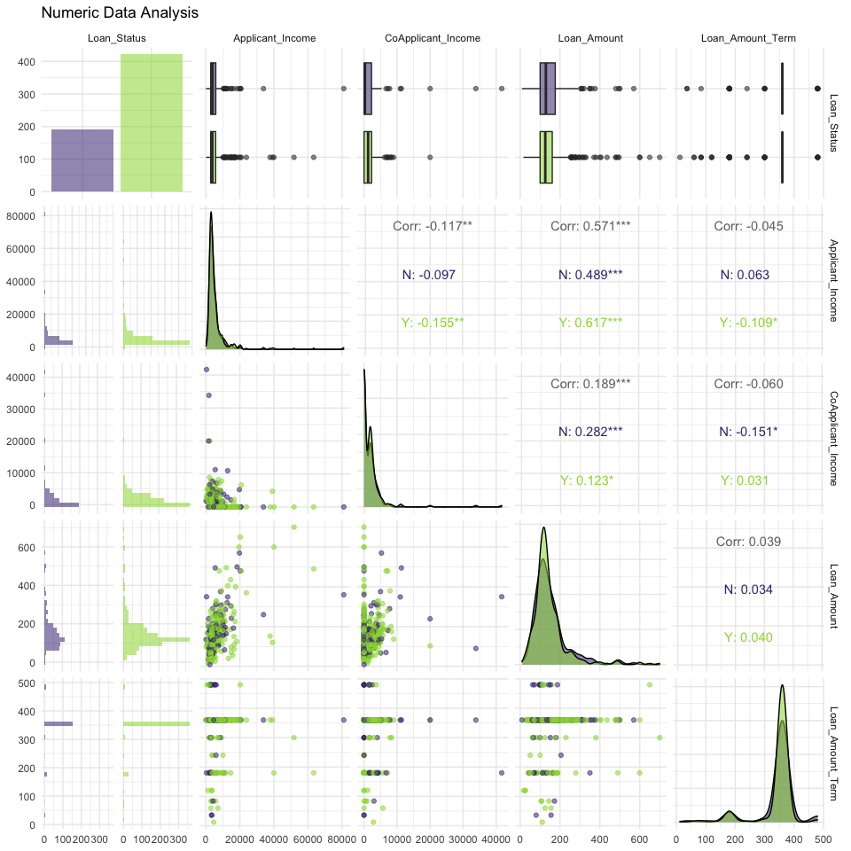
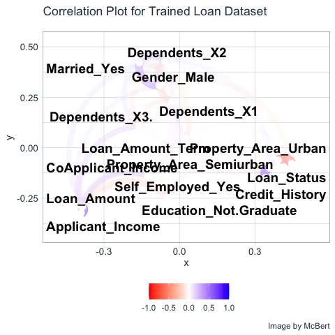

## 개요

-   새로운 ML 라이브러리인 `tidymodels`를 활용하여 분류 모델을 개발해본다.

## 데이터

-   데이터는 `Loan Prediction Practice Problem`에서 가져왔다.

    -   URL: <https://datahack.analyticsvidhya.com/contest/practice-problem-loan-prediction-iii/#ProblemStatement>

-   회원가입 후, 대회 참여를 하면 3개의 파일을 다운로드 받을 수 있다.

    -   Train file, Test file, Submission File

### Data Dictionary

-   `Train 파일`의 데이터 명세서는 다음과 같다. 

-   `Test 파일`의 데이터 명세서는 다음과 같다. 

-   `Submission 파일`의 데이터 명세서는 다음과 같다. 

## 대회목적

-   대출 승인 여부를 결정하는 모델을 만드는 것이 대회의 주 목적이며. 평가지표는 분류모형의 `Accurarcy`로 결정한다.

## 패키지 및 데이터 불러오기

-   먼저 필수 패키지를 불러온다.


```r
# 데이터 수집
library(readr)

# 데이터 가공
library(dplyr) # 데이터 가공
library(tidyr) # 컬럼 변경
library(stringr) # 문자열 데이터 다루기 
library(forcats) # 범주형 데이터 다루기
library(skimr) # 데이터 요약
library(magrittr) # 파이프라인 작성


# 데이터 시각화
library(ggplot2) # 데이터 시각화 
library(corrr) # 상관관계 시각화
library(skimr) # 데이터 요약
library(patchwork) # 데이터 시각화 분할
library(GGally) # 산점도

# 데이터 모델링
library(tidymodels) # ML Packages 
library(themis) # class imbalance 처리
library(discrim) # 베이지안 모델링
library(tidyposterior) # 베이지안 모델링 성능 비교
library(doParallel) # CPU cores 확인
library(treesnip) # https://github.com/curso-r/treesnip
```

-   이번에는 데이터를 불러오도록 한다.


```r
train = read_csv("data/train_ctrUa4K.csv")
```

```
## Rows: 614 Columns: 13
```

```
## ── Column specification ────────────────────────────────────────────────────────
## Delimiter: ","
## chr (8): Loan_ID, Gender, Married, Dependents, Education, Self_Employed, Pro...
## dbl (5): ApplicantIncome, CoapplicantIncome, LoanAmount, Loan_Amount_Term, C...
```

```
## 
## ℹ Use `spec()` to retrieve the full column specification for this data.
## ℹ Specify the column types or set `show_col_types = FALSE` to quiet this message.
```

```r
train %<>% rename(Applicant_Income = ApplicantIncome,
                  CoApplicant_Income = CoapplicantIncome,
                  Loan_Amount = LoanAmount) 

loan_id = train$Loan_ID
train %<>% select(-Loan_ID) %>% mutate(Credit_History = as.character(Credit_History))
str(train)
```

```
## tibble [614 × 12] (S3: tbl_df/tbl/data.frame)
##  $ Gender            : chr [1:614] "Male" "Male" "Male" "Male" ...
##  $ Married           : chr [1:614] "No" "Yes" "Yes" "Yes" ...
##  $ Dependents        : chr [1:614] "0" "1" "0" "0" ...
##  $ Education         : chr [1:614] "Graduate" "Graduate" "Graduate" "Not Graduate" ...
##  $ Self_Employed     : chr [1:614] "No" "No" "Yes" "No" ...
##  $ Applicant_Income  : num [1:614] 5849 4583 3000 2583 6000 ...
##  $ CoApplicant_Income: num [1:614] 0 1508 0 2358 0 ...
##  $ Loan_Amount       : num [1:614] NA 128 66 120 141 267 95 158 168 349 ...
##  $ Loan_Amount_Term  : num [1:614] 360 360 360 360 360 360 360 360 360 360 ...
##  $ Credit_History    : chr [1:614] "1" "1" "1" "1" ...
##  $ Property_Area     : chr [1:614] "Urban" "Rural" "Urban" "Urban" ...
##  $ Loan_Status       : chr [1:614] "Y" "N" "Y" "Y" ...
```

-   총 614개의 데이터에 13개의 컬럼이 있다.

## 탐색적 자료분석 (EDA)

-   우선 skim() 함수를 활용하도록 한다.


```r
skim(train)
```


Table: Data summary

|                         |      |
|:------------------------|:-----|
|Name                     |train |
|Number of rows           |614   |
|Number of columns        |12    |
|_______________________  |      |
|Column type frequency:   |      |
|character                |8     |
|numeric                  |4     |
|________________________ |      |
|Group variables          |None  |


**Variable type: character**

|skim_variable  | n_missing| complete_rate| min| max| empty| n_unique| whitespace|
|:--------------|---------:|-------------:|---:|---:|-----:|--------:|----------:|
|Gender         |        13|          0.98|   4|   6|     0|        2|          0|
|Married        |         3|          1.00|   2|   3|     0|        2|          0|
|Dependents     |        15|          0.98|   1|   2|     0|        4|          0|
|Education      |         0|          1.00|   8|  12|     0|        2|          0|
|Self_Employed  |        32|          0.95|   2|   3|     0|        2|          0|
|Credit_History |        50|          0.92|   1|   1|     0|        2|          0|
|Property_Area  |         0|          1.00|   5|   9|     0|        3|          0|
|Loan_Status    |         0|          1.00|   1|   1|     0|        2|          0|


**Variable type: numeric**

|skim_variable      | n_missing| complete_rate|    mean|      sd|  p0|    p25|    p50|     p75|  p100|hist  |
|:------------------|---------:|-------------:|-------:|-------:|---:|------:|------:|-------:|-----:|:-----|
|Applicant_Income   |         0|          1.00| 5403.46| 6109.04| 150| 2877.5| 3812.5| 5795.00| 81000|▇▁▁▁▁ |
|CoApplicant_Income |         0|          1.00| 1621.25| 2926.25|   0|    0.0| 1188.5| 2297.25| 41667|▇▁▁▁▁ |
|Loan_Amount        |        22|          0.96|  146.41|   85.59|   9|  100.0|  128.0|  168.00|   700|▇▃▁▁▁ |
|Loan_Amount_Term   |        14|          0.98|  342.00|   65.12|  12|  360.0|  360.0|  360.00|   480|▁▁▁▇▁ |

## 데이터 시각화

-   데이터 시각화의 기본적인 가이드라인은 아래 그림을 참조 한다.

    -   [20 ideas for better data visualization](https://uxdesign.cc/20-ideas-for-better-data-visualization-73f7e3c2782d)


### 단변량 시각화

-   각 개별적인 컬럼에 대해 시각화를 자동으로 할 수 있는 코드를 작성해본다.


```r
plot_by_column_type <- function(x, y) {
  # cat("y is:", y)
  viz_title <- str_replace_all(y, "_", " ") %>% 
    str_to_title()
  
  if ("factor" %in% class(x)) {
    ggplot(train, aes(x, fill = x)) + 
      geom_bar() + 
      theme(legend.position = "none", 
            axis.text.x = element_text(angle = 45, hjust = 1), 
            axis.text = element_text(size = 8)) + 
      scale_fill_viridis_d() + 
      theme_minimal() + 
      labs(title = viz_title, y = "", x = "")
  } else if ("numeric" %in% class(x)) {
    ggplot(train, aes(x)) + 
      geom_histogram() + 
      scale_fill_viridis_d() + 
      theme_minimal() + 
      labs(title = viz_title, y = "", x = "")
  } else if ("integer" %in% class(x)) {
    ggplot(train, aes(x)) + 
      geom_histogram() + 
      scale_fill_viridis_d() + 
      theme_minimal() + 
      labs(title = viz_title, y = "", x = "")
  } else if ("character" %in% class(x)) {
    ggplot(train, aes(x, fill = x)) + 
      geom_bar() + 
      theme(legend.position = "none", 
            axis.text.x = element_text(angle = 45, hjust = 1), 
            axis.text = element_text(size = 8)) + 
      scale_fill_viridis_d() + 
      theme_minimal() + 
      labs(title = viz_title, y = "", x = "")
  }
}

multiple_plots = map2(train, colnames(train), plot_by_column_type) %>% 
  wrap_plots(ncol = 3, nrow = 5)

multiple_plots
```

<!-- -->

-   위 데이터를 간단하게 설명하면 다음과 같다.

    -   대출 지원자의 성별은 남성이 여성보다 많다.
    -   대출 지원자의 결혼 유무는 기혼자가 더 많다.
    -   대출 지원자 중 상당수는 자녀가 없다.
    -   대출 지원자 중 상당수는 대학을 졸업했고, `self-employed`가 아니다.
    -   대출 지원자의 수입은 `right skewed`이다.
    -   `co-applicant`의 수입도 `right skewed`이다.
    -   대출 지원자 중 약 2/3은 대출을 승인받았다.

### 양적 변수 시각화

-   양적 변수 시각화를 하기 위해서는 산점도를 작성하는 것이 좋다.
-   관계성을 파악하기에도 매우 유용하다.


```r
num_df <- train %>% 
  select(Loan_Status, where(is.numeric)) 

str(num_df)
```

```
## tibble [614 × 5] (S3: tbl_df/tbl/data.frame)
##  $ Loan_Status       : chr [1:614] "Y" "N" "Y" "Y" ...
##  $ Applicant_Income  : num [1:614] 5849 4583 3000 2583 6000 ...
##  $ CoApplicant_Income: num [1:614] 0 1508 0 2358 0 ...
##  $ Loan_Amount       : num [1:614] NA 128 66 120 141 267 95 158 168 349 ...
##  $ Loan_Amount_Term  : num [1:614] 360 360 360 360 360 360 360 360 360 360 ...
```

```r
ggpairs(num_df, aes(color = train$Loan_Status, alpha = 0.3)) + 
  theme_minimal() + 
  scale_fill_viridis_d(aesthetics = c("color", "fill"), begin = 0.15, end = 0.85) + 
  labs(title = "Numeric Data Analysis")
```

<!-- -->

### 질적 변수 시각화

-   이번에는 질적 변수 시각화를 진행하도록 한다.
-   우선, 질적 변수 시각화를 진행하기에 앞서서 평균과 신뢰구간을 구하도록 한다.
-   평균을 구하려면 우선 숫자 데이터를 만들어야 하는데, `Loan_Status` 대출을 승인받았으면 1, 그렇지 않으면 0이라고 표시를 한다.


```r
qual_df <- train %>% 
  select(where(is.character)) %>% 
  drop_na() %>% 
  mutate(Loan_Status = if_else(Loan_Status == "Y", 1, 0)) %>% 
  pivot_longer(1:7, names_to = "Variables", values_to = "Values") %>% 
  group_by(Variables, Values) %>% 
  summarise(mean = mean(Loan_Status), 
            conf_val = 1.96 * sd(Loan_Status) / sqrt(n())) %>% 
  pivot_wider(names_from = Variables, values_from = Values)
```

```
## `summarise()` has grouped output by 'Variables'. You can override using the `.groups` argument.
```

```r
qual_df
```

```
## # A tibble: 17 × 9
##      mean conf_val Credit_History Dependents Education    Gender Married
##     <dbl>    <dbl> <chr>          <chr>      <chr>        <chr>  <chr>  
##  1 0.0875   0.0623 0              <NA>       <NA>         <NA>   <NA>   
##  2 0.789    0.0386 1              <NA>       <NA>         <NA>   <NA>   
##  3 0.673    0.0537 <NA>           0          <NA>         <NA>   <NA>   
##  4 0.647    0.102  <NA>           1          <NA>         <NA>   <NA>   
##  5 0.75     0.0910 <NA>           2          <NA>         <NA>   <NA>   
##  6 0.636    0.144  <NA>           3+         <NA>         <NA>   <NA>   
##  7 0.701    0.0449 <NA>           <NA>       Graduate     <NA>   <NA>   
##  8 0.6      0.0920 <NA>           <NA>       Not Graduate <NA>   <NA>   
##  9 0.626    0.0999 <NA>           <NA>       <NA>         Female <NA>   
## 10 0.690    0.0443 <NA>           <NA>       <NA>         Male   <NA>   
## 11 0.617    0.0712 <NA>           <NA>       <NA>         <NA>   No     
## 12 0.713    0.0488 <NA>           <NA>       <NA>         <NA>   Yes    
## 13 0.604    0.0788 <NA>           <NA>       <NA>         <NA>   <NA>   
## 14 0.777    0.0583 <NA>           <NA>       <NA>         <NA>   <NA>   
## 15 0.630    0.0739 <NA>           <NA>       <NA>         <NA>   <NA>   
## 16 0.683    0.0435 <NA>           <NA>       <NA>         <NA>   <NA>   
## 17 0.657    0.112  <NA>           <NA>       <NA>         <NA>   <NA>   
## # … with 2 more variables: Property_Area <chr>, Self_Employed <chr>
```

-   이제 시각화를 그려본다.


```r
viz_plot <- function(data, column_name) {
  column <- sym(column_name)
  # cat("column:", enquo(column_name))
  data %>% select({{ column }}, mean, conf_val) %>% 
  drop_na() %>% 
  ggplot(aes(x= {{ column }}, y = mean, color = {{ column }})) +
  geom_point() +
  geom_errorbar(aes(ymin = mean - conf_val, ymax = mean + conf_val), width = 0.1) +
  theme_minimal() +
  theme(legend.position = "none",
        axis.title.x = element_blank(),
        axis.title.y = element_blank()) +
  scale_colour_viridis_d(aesthetics = c("color", "fill"), begin = 0.15, end = 0.85) +
  labs(title=column_name)
}

column_names = colnames(qual_df %>% select(-c(mean, conf_val)))
plots <- list()
for (i in seq_along(column_names)) {
  p1 <- viz_plot(qual_df, column_names[i])
  plots[[i]] <- p1
}

wrap_plots(plots) + plot_annotation(
  title = 'Proportion of Loan Data - Categorical Variables',
  subtitle = 'With 95% Confidence Intervals',
  caption = 'Data Source: Loan Prediction Problem by Analytics Vidhya'
)
```

<!-- -->

-   간단하게 요약하면 다음과 같다.

    -   Married 지원자가 대출을 승인 받을 가능성이 더 높다.
    -   대졸자가 그렇지 않은 사람보다 대출을 승인 받을 가능성이 더 높다.\
    -   자녀들 변수는 큰 영향이 없는 것으로 보인다.
    -   여성 신청자수는 변동성이 큰 반면, 남성들의 경우 상대적으로 변동성이 작아 보인다.
    -   Credit History의 유무에 따라 매우 큰 변동성이 있는 것으로 확인되었다.

## 데이터 분리

-   약 8:2로 데이터를 분리하도록 하는데, Loan_Status의 비율에 따라서 층화추출(Stratified Sampling) 방식을 취하도록 한다.


```r
set.seed(101)
loan_split <- initial_split(train, prop = 0.8, strata = Loan_Status)
```

## 모델 개발

-   분류 모형을 개발하도록 한다.
-   이때, logistic, decision tree, random forest, xgboost 총 4개의 모델을 개발하도록 한다.


```r
logistic_ml = logistic_reg(penalty = tune(), mixture = tune()) %>% 
  set_engine("glmnet") %>% 
  set_mode("classification")

dt_ml <- decision_tree(cost_complexity = tune(), 
                       tree_depth = tune(), 
                       min_n = tune()) %>% 
  set_engine("rpart") %>% 
  set_mode("classification")

rf_ml <- rand_forest(mtry = tune(), trees = tune(), min_n = tune()) %>% 
  set_engine("ranger") %>% 
  set_mode("classification")
  
xgboost_ml <- boost_tree(mtry = tune(), tree = tune(), min_n = tune(), tree_depth = tune(), learn_rate = tune(), loss_reduction = tune(), sample_size = tune()) %>% 
  set_engine("xgboost") %>% 
  set_mode("classification")
```

## Feature Engineering

-   `tidymodels`에서는 feature engineering을 수행하기 위해 recipe 함수를 적용한다.
-   결측치 처리를 위해 bagged tree models, impute_mean, impute_node 등을 사용했다.


```r
recipe_1 <- recipe(Loan_Status ~ ., data = training(loan_split)) %>% 
  step_mutate(Credit_History = if_else(Credit_History == 1, 1, -1, 0)) %>% 
  step_scale(all_numeric_predictors(), -Credit_History) %>% 
  step_impute_bag(Gender, 
                  Married, 
                  Dependents, 
                  Self_Employed, 
                  Loan_Amount, 
                  Loan_Amount_Term) %>% 
  step_dummy(all_nominal_predictors())

recipe_2 <- recipe(Loan_Status ~ ., data = training(loan_split)) %>% 
  step_mutate(Credit_History = if_else(Credit_History == 1, 1, -1, 0)) %>% 
  step_scale(all_numeric_predictors(), -Credit_History) %>%  
  step_impute_mean(all_numeric_predictors()) %>%
  step_impute_mode(all_nominal_predictors()) %>% 
  step_dummy(all_nominal_predictors()) %>% 
  step_zv(all_predictors())
```

-   모델 개발을 위해 recipe_1를 적용한 train, validation 데이터를 준비한다.
-   실제 테스트 데이터가 존재하기 때문에, 여기에서는 validation 이라고 명명했다.


```r
loan_train_df = recipe_1 %>% prep() %>% bake(new_data = NULL)
loan_validation_df = recipe_1 %>% prep() %>% bake(testing(loan_split))
```

### Correlation Graph

-   실제 변환된 데이터를 불러와서 상관관계 그래프를 작성하도록 한다.
-   먼저 train & validation 데이터를 합치도록 한다.


```r
loan_train_df %>% 
  bind_rows(loan_validation_df) %>% 
  mutate(Loan_Status = if_else(Loan_Status == "Y", 1, 0)) %>% 
  correlate() %>% 
  rearrange() -> static_correlations
```

```
## 
## Correlation method: 'pearson'
## Missing treated using: 'pairwise.complete.obs'
```

```r
static_correlations
```

```
## # A tibble: 15 × 16
##    term              Property_Area_Urb… Loan_Amount Applicant_Income Gender_Male
##    <chr>                          <dbl>       <dbl>            <dbl>       <dbl>
##  1 Property_Area_Ur…          NA           -0.0419         -0.000598     0.0374 
##  2 Loan_Amount                -0.0419      NA               0.579        0.0967 
##  3 Applicant_Income           -0.000598     0.579          NA            0.0559 
##  4 Gender_Male                 0.0374       0.0967          0.0559      NA      
##  5 Dependents_X3.             -0.0475       0.144           0.157        0.0820 
##  6 Married_Yes                 0.00294      0.147           0.0491       0.376  
##  7 CoApplicant_Inco…           0.0228       0.182          -0.117        0.0850 
##  8 Dependents_X1               0.0812       0.0559          0.0392      -0.00964
##  9 Self_Employed_Yes          -0.0234       0.123           0.123       -0.0212 
## 10 Education_Not.Gr…          -0.0343      -0.175          -0.141        0.0474 
## 11 Dependents_X2               0.0226       0.0181         -0.0315       0.138  
## 12 Loan_Amount_Term           -0.0978       0.0397         -0.0458      -0.0742 
## 13 Credit_History             -0.0335      -0.0154         -0.00502      0.0177 
## 14 Loan_Status                -0.0436      -0.0385         -0.00471      0.0151 
## 15 Property_Area_Se…          -0.548       -0.00667        -0.0142      -0.114  
## # … with 11 more variables: Dependents_X3. <dbl>, Married_Yes <dbl>,
## #   CoApplicant_Income <dbl>, Dependents_X1 <dbl>, Self_Employed_Yes <dbl>,
## #   Education_Not.Graduate <dbl>, Dependents_X2 <dbl>, Loan_Amount_Term <dbl>,
## #   Credit_History <dbl>, Loan_Status <dbl>, Property_Area_Semiurban <dbl>
```

-   시각화를 작성해본다.


```r
library(tidyquant)
```

```
## Loading required package: lubridate
```

```
## 
## Attaching package: 'lubridate'
```

```
## The following objects are masked from 'package:base':
## 
##     date, intersect, setdiff, union
```

```
## Loading required package: PerformanceAnalytics
```

```
## Loading required package: xts
```

```
## Loading required package: zoo
```

```
## 
## Attaching package: 'zoo'
```

```
## The following objects are masked from 'package:base':
## 
##     as.Date, as.Date.numeric
```

```
## 
## Attaching package: 'xts'
```

```
## The following objects are masked from 'package:dplyr':
## 
##     first, last
```

```
## 
## Attaching package: 'PerformanceAnalytics'
```

```
## The following object is masked from 'package:graphics':
## 
##     legend
```

```
## Loading required package: quantmod
```

```
## Loading required package: TTR
```

```
## 
## Attaching package: 'TTR'
```

```
## The following object is masked from 'package:dials':
## 
##     momentum
```

```
## Registered S3 method overwritten by 'quantmod':
##   method            from
##   as.zoo.data.frame zoo
```

```
## ══ Need to Learn tidyquant? ════════════════════════════════════════════════════
## Business Science offers a 1-hour course - Learning Lab #9: Performance Analysis & Portfolio Optimization with tidyquant!
## </> Learn more at: https://university.business-science.io/p/learning-labs-pro </>
```

```r
static_correlations %>%
    network_plot(min_cor = 0.05, colours = c("red", "white", "blue"), legend = TRUE) +
    labs(
        title = "Correlation Plot for Trained Loan Dataset",
        subtitle = "", 
        caption = "Image by McBert"
        ) +
    expand_limits(x = c(-0.1, 0.1), y = c(-0.4, 0.4)) +
    theme_tq() +
    theme(legend.position = "bottom", 
          axis.text = element_text(size = 10))
```

<!-- -->

-   위 그래프를 보면, `Loan_Status`와 가장 연관성이 큰 데이터는 `Credit_History`이다. 상식적으로 생각해도, `기존 대출 이력`이 있는 사람에게 더 많은 대출을 하고자 하는 은행의 경향성을 생각하면 대략적으로 이해가 가는 결과임을 알 수 있다.

## Workflow Sets

-   Recipe List와 Model List를 만들어 본다.


```r
recipe_list <- list(Recipe1 = recipe_1, Recipe2 = recipe_2)
model_list <- list(Random_Forest = rf_ml, Decision_Tree = dt_ml, Logistic_Regression = logistic_ml, XGBoost = xgboost_ml)
```

-   workflow_sets()를 활용하여 최종적인 model_set를 완료한다.
-   `cross = T`는 recipe의 각 조건과 머신러닝 알고리즘과 매칭되는 모든 가능한 조건들을 Combination 하도록 허락하는 설정으로 이해하면 된다.


```r
model_set = workflow_set(preproc = recipe_list, models = model_list, cross = T)
```

## 모델 학습

-   이제 모델을 학습해보도록 한다.


```r
set.seed(2)
train_resamples = bootstraps(training(loan_split), strata = Loan_Status)
detectCores()
```

```
## [1] 8
```

```r
registerDoParallel(cores = 6)
all_workflows <- model_set %>% workflow_map(resamples = train_resamples, verbose = TRUE)
```

```
## i 1 of 8 tuning:     Recipe1_Random_Forest
```

```
## i Creating pre-processing data to finalize unknown parameter: mtry
```

```
## ✓ 1 of 8 tuning:     Recipe1_Random_Forest (37.8s)
```

```
## i 2 of 8 tuning:     Recipe1_Decision_Tree
```

```
## ✓ 2 of 8 tuning:     Recipe1_Decision_Tree (23.6s)
```

```
## i 3 of 8 tuning:     Recipe1_Logistic_Regression
```

```
## ✓ 3 of 8 tuning:     Recipe1_Logistic_Regression (24.4s)
```

```
## i 4 of 8 tuning:     Recipe1_XGBoost
```

```
## i Creating pre-processing data to finalize unknown parameter: mtry
```

```
## ✓ 4 of 8 tuning:     Recipe1_XGBoost (42.4s)
```

```
## i 5 of 8 tuning:     Recipe2_Random_Forest
```

```
## i Creating pre-processing data to finalize unknown parameter: mtry
```

```
## ✓ 5 of 8 tuning:     Recipe2_Random_Forest (41.3s)
```

```
## i 6 of 8 tuning:     Recipe2_Decision_Tree
```

```
## ✓ 6 of 8 tuning:     Recipe2_Decision_Tree (21.2s)
```

```
## i 7 of 8 tuning:     Recipe2_Logistic_Regression
```

```
## ✓ 7 of 8 tuning:     Recipe2_Logistic_Regression (21.4s)
```

```
## i 8 of 8 tuning:     Recipe2_XGBoost
```

```
## i Creating pre-processing data to finalize unknown parameter: mtry
```

```
## ✓ 8 of 8 tuning:     Recipe2_XGBoost (37.6s)
```

### 모델학습 비교
- 이제 모형 학습이 완료가 되었다면, 시각화로 어떤 모델이 좋은지를 확인해보도록 한다. 
- 우선 학습된 데이터를 확인해보도록 한다. 

```r
library(tune)
collect_metrics(all_workflows)
```

```
## # A tibble: 160 × 9
##    wflow_id     .config    preproc model  .metric .estimator  mean     n std_err
##    <chr>        <chr>      <chr>   <chr>  <chr>   <chr>      <dbl> <int>   <dbl>
##  1 Recipe1_Ran… Preproces… recipe  rand_… accura… binary     0.773    25 0.00389
##  2 Recipe1_Ran… Preproces… recipe  rand_… roc_auc binary     0.746    25 0.00623
##  3 Recipe1_Ran… Preproces… recipe  rand_… accura… binary     0.772    25 0.00417
##  4 Recipe1_Ran… Preproces… recipe  rand_… roc_auc binary     0.748    25 0.00643
##  5 Recipe1_Ran… Preproces… recipe  rand_… accura… binary     0.760    25 0.00369
##  6 Recipe1_Ran… Preproces… recipe  rand_… roc_auc binary     0.743    25 0.00628
##  7 Recipe1_Ran… Preproces… recipe  rand_… accura… binary     0.798    25 0.00314
##  8 Recipe1_Ran… Preproces… recipe  rand_… roc_auc binary     0.738    25 0.00589
##  9 Recipe1_Ran… Preproces… recipe  rand_… accura… binary     0.771    25 0.00406
## 10 Recipe1_Ran… Preproces… recipe  rand_… roc_auc binary     0.742    25 0.00599
## # … with 150 more rows
```

- 현재 결과물에서 `accuracy`에서 추출하고, 그 외 필요한 데이터 가공을 진행하도록 한다. 


```r
collect_metrics(all_workflows) %>% 
  tidyr::separate(wflow_id, into = c("Recipe", "Model_Type"), sep = "_", remove = F, extra = "merge") %>% 
  filter(.metric == "accuracy") %>% 
  group_by(model) %>% 
  select(-.config) %>% 
  distinct() %>% 
  group_by(Recipe, Model_Type, .metric) %>% 
  summarise(mean = mean(mean), 
            std_err = mean(std_err), .groups = "drop") %>% 
  mutate(Workflow_Rank = row_number(-mean), 
         .metric = str_to_upper(.metric)) %>% 
  ggplot(aes(x = Workflow_Rank, y = mean, shape = Recipe, color = Model_Type)) + 
  geom_point(size = 2, alpha = 0.7) + 
  geom_errorbar(aes(ymin = mean-std_err, ymax = mean + std_err), position = position_dodge(0.9)) + 
  theme_minimal() + 
  labs(title = "Performance Comparison of Workflow Sets with Tidymodels", 
       subtitle = "Bootstrap Resamplings Procedure 25 Times", 
       caption = "Image Created By McBert", 
       x = "WorkFlow Rank by ML Model", 
       y = "Accuracy", 
       color = "Model Types", 
       shape = "Recipes")
```

<!-- -->

