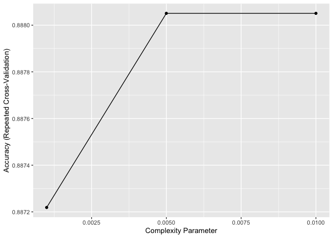
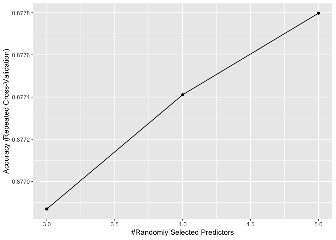
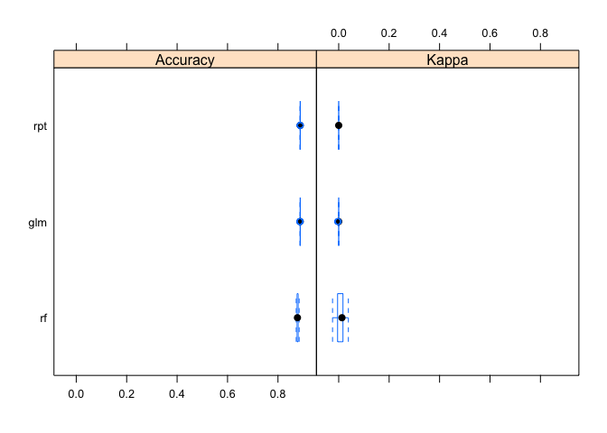

## 1. 병렬처리를 위한 패키지 불러오기


```r
library(caret) # 머신러닝을 위한 패키지
```

```
## Loading required package: ggplot2
```

```
## Loading required package: lattice
```

```r
library(tidyverse) # 데이터 핸들링 및 시각화를 위한 패키지
```

```
## ── Attaching packages ─────────────────────────────────────── tidyverse 1.3.1 ──
```

```
## ✓ tibble  3.1.6     ✓ dplyr   1.0.7
## ✓ tidyr   1.1.4     ✓ stringr 1.4.0
## ✓ readr   2.1.0     ✓ forcats 0.5.1
## ✓ purrr   0.3.4
```

```
## ── Conflicts ────────────────────────────────────────── tidyverse_conflicts() ──
## x dplyr::filter() masks stats::filter()
## x dplyr::lag()    masks stats::lag()
## x purrr::lift()   masks caret::lift()
```

```r
library(doParallel) # 병렬처리를 위한 패키지
```

```
## Loading required package: foreach
```

```
## 
## Attaching package: 'foreach'
```

```
## The following objects are masked from 'package:purrr':
## 
##     accumulate, when
```

```
## Loading required package: iterators
```

```
## Loading required package: parallel
```

- 병렬처리
  + 주 목적: 속도 때문에 씀
  + 원리 및 기타 설명은 다음 링크를 참고한다. 
  + https://freshrimpsushi.tistory.com/1266


```r
detectCores() # 현재 자기 컴퓨터의 코어 개수를 반환한다
```

```
## [1] 8
```

- 병렬처리에 쓸 코어를 등록한다. 
- 보통 50% 쓰는 것을 추천한다. (이유: 모형이 개발되는 동안 다른 간단한 작업도 해야 함)


```r
cl <- parallel::makeCluster(6, setup_timeout = 0.5)
registerDoParallel(cl)
```

## 2. 데이터 가져오기
- 경로를 확인한 뒤 데이터를 가져온다. 


```r
loan_data <- read.csv("data/cleaned_loan_data.csv", stringsAsFactors = FALSE)
dim(loan_data)
```

```
## [1] 29091     8
```

## 3. 데이터 전처리
- 경로를 확인한 뒤 데이터를 가져온다. 
- 먼저 중복값을 확인한다. 

```r
sapply(loan_data, function(x) sum(is.na(x)))
```

```
##    loan_status      loan_amnt          grade home_ownership     annual_inc 
##              0              0              0              0              0 
##            age        emp_cat         ir_cat 
##              0              0              0
```

- 데이터 타입을 확인한다. 

```r
loan_data %>% duplicated() %>% sum() # 374개 확인
```

```
## [1] 374
```

```r
loan_data2 <- loan_data %>% distinct()
```

- 데이터 타입을 확인한다. 

```r
glimpse(loan_data2)
```

```
## Rows: 28,717
## Columns: 8
## $ loan_status    <int> 0, 0, 0, 0, 0, 0, 1, 0, 1, 0, 0, 0, 0, 0, 1, 0, 0, 1, 0…
## $ loan_amnt      <int> 5000, 2400, 10000, 5000, 3000, 12000, 9000, 3000, 10000…
## $ grade          <chr> "B", "C", "C", "A", "E", "B", "C", "B", "B", "D", "C", …
## $ home_ownership <chr> "RENT", "RENT", "RENT", "RENT", "RENT", "OWN", "RENT", …
## $ annual_inc     <dbl> 24000.00, 12252.00, 49200.00, 36000.00, 48000.00, 75000…
## $ age            <int> 33, 31, 24, 39, 24, 28, 22, 22, 28, 22, 23, 27, 30, 24,…
## $ emp_cat        <chr> "0-15", "15-30", "0-15", "0-15", "0-15", "0-15", "0-15"…
## $ ir_cat         <chr> "8-11", "Missing", "11-13.5", "Missing", "Missing", "11…
```

- 우선 타겟 데이터는 영어로 표현한다. 

```r
loan_data2$loan_status <- factor(loan_data2$loan_status, levels = c(0, 1), labels = c("non_default", "default"))
loan_data2$grade <- as.factor(loan_data2$grade)
loan_data2$home_ownership <- as.factor(loan_data2$home_ownership)
```

- 만약 한꺼번에 하고 싶다면 다음과 같이 할 수 있다. 

```r
loan_data2 <- loan_data2 %>% 
  mutate_if(is.character, as.factor)
```

- chr 데이터가 모두 factor로 바뀌었는지 확인한다. 

```r
glimpse(loan_data2)
```

```
## Rows: 28,717
## Columns: 8
## $ loan_status    <fct> non_default, non_default, non_default, non_default, non…
## $ loan_amnt      <int> 5000, 2400, 10000, 5000, 3000, 12000, 9000, 3000, 10000…
## $ grade          <fct> B, C, C, A, E, B, C, B, B, D, C, A, B, A, B, B, B, B, B…
## $ home_ownership <fct> RENT, RENT, RENT, RENT, RENT, OWN, RENT, RENT, RENT, RE…
## $ annual_inc     <dbl> 24000.00, 12252.00, 49200.00, 36000.00, 48000.00, 75000…
## $ age            <int> 33, 31, 24, 39, 24, 28, 22, 22, 28, 22, 23, 27, 30, 24,…
## $ emp_cat        <fct> 0-15, 15-30, 0-15, 0-15, 0-15, 0-15, 0-15, 0-15, 0-15, …
## $ ir_cat         <fct> 8-11, Missing, 11-13.5, Missing, Missing, 11-13.5, 11-1…
```

## 4. 데이터 분리
- 훈련 데이터와 테스트 데이터로 분리한다. 

```r
set.seed(2021)
inx   <- createDataPartition(loan_data2$loan_status, p = 0.6, list = F)
train <- loan_data2[ inx, ]
test  <- loan_data2[-inx, ]
```

## 5. 모형 개발 준비
- caret 패키지에서의 모형 개발 관련해서는 다음 웹사이트에서 확인 하기를 바란다. 
  + Ref. http://appliedpredictivemodeling.com/
  
### (1) Controller 
- trainControl 함수를 활용하여 기본 세팅을 진행한다. 


```r
control <- trainControl(
  method  = "repeatedcv",
  number  = 10, # 10겹
  repeats = 3, # 3번
  search  = "grid",
  classProbs = TRUE)
```

### (2) Feature Engineering
- 통계처리를 진행한다. 

```r
preProc <- c("BoxCox", 
             "center",
             "scale",
             "spatialSign",
             "corr",
             "zv")
```

### (3) 독립 변수와 종속 변수의 정의
-  독립변수와 종속 변수를 정의한다. 


```r
frml <- loan_status ~ loan_amnt + grade + home_ownership + annual_inc + age + emp_cat + ir_cat
```

## 6. 모형개발
- 개발준비가 끝났다면, 다양한 모델을 개발하도록 한다. 
- 

### (1) 로지스틱회귀분석

```r
logis <- train(
  frml, 
  data = train, 
  method = "glm", 
  metric = "Accuracy", 
  trControl = control, 
  preProcess = preProc
)

logis
```

```
## Generalized Linear Model 
## 
## 17231 samples
##     7 predictor
##     2 classes: 'non_default', 'default' 
## 
## Pre-processing: Box-Cox transformation (3), centered (20), scaled (20),
##  spatial sign transformation (20) 
## Resampling: Cross-Validated (10 fold, repeated 3 times) 
## Summary of sample sizes: 15509, 15508, 15508, 15507, 15508, 15507, ... 
## Resampling results:
## 
##   Accuracy   Kappa        
##   0.8878377  -0.0004200657
```
### (2) 의사결정나무
- 의사결정 나무에서 하이퍼파라미터를 정의한다. 

```r
rpartGrid <- expand.grid(cp = c(0.001, 0.005, 0.01))
modelLookup("rpart")
```

```
##   model parameter                label forReg forClass probModel
## 1 rpart        cp Complexity Parameter   TRUE     TRUE      TRUE
```

- 이제 모형을 개발한다. 

```r
set.seed(2021)
rpt <- train(
  frml, 
  data = train,
  method     = "rpart",
  metric     = "Accuracy",
  trControl  = control,
  preProcess = preProc,
  tuneGrid   = rpartGrid)

rpt
```

```
## CART 
## 
## 17231 samples
##     7 predictor
##     2 classes: 'non_default', 'default' 
## 
## Pre-processing: Box-Cox transformation (3), centered (20), scaled (20),
##  spatial sign transformation (20) 
## Resampling: Cross-Validated (10 fold, repeated 3 times) 
## Summary of sample sizes: 15508, 15507, 15508, 15508, 15508, 15508, ... 
## Resampling results across tuning parameters:
## 
##   cp     Accuracy   Kappa      
##   0.001  0.8872189  0.008546392
##   0.005  0.8880506  0.000000000
##   0.010  0.8880506  0.000000000
## 
## Accuracy was used to select the optimal model using the largest value.
## The final value used for the model was cp = 0.01.
```

```r
ggplot(rpt)
```

<!-- -->


### (3) 랜덤포레스트
- 이번에는 랜덤포레스트를 사용하기 위한 하이퍼파라미터를 정의한다. 

```r
rfGrid <- expand.grid(mtry = c(3, 4, 5))
modelLookup("rf")
```

```
##   model parameter                         label forReg forClass probModel
## 1    rf      mtry #Randomly Selected Predictors   TRUE     TRUE      TRUE
```

- 랜덤포레스트 모델을 개발한다. 

```r
rf <- train(
  frml, 
  data = train, 
  method = "rf", 
  metric = "Accuracy", 
  trControl = control, 
  preProcess = preProc, 
  tuneGrid = rfGrid
)

rf
```

```
## Random Forest 
## 
## 17231 samples
##     7 predictor
##     2 classes: 'non_default', 'default' 
## 
## Pre-processing: Box-Cox transformation (3), centered (20), scaled (20),
##  spatial sign transformation (20) 
## Resampling: Cross-Validated (10 fold, repeated 3 times) 
## Summary of sample sizes: 15508, 15508, 15507, 15508, 15509, 15508, ... 
## Resampling results across tuning parameters:
## 
##   mtry  Accuracy   Kappa      
##   3     0.8768692  0.005206944
##   4     0.8774109  0.005965678
##   5     0.8777978  0.008642398
## 
## Accuracy was used to select the optimal model using the largest value.
## The final value used for the model was mtry = 5.
```


```r
ggplot(rf)
```

<!-- -->

## 7. 모형 Resampling
- 3개의 모형을 비교하도록 한다. 


```r
resamps <- resamples(
  list(glm = logis,
       rpt = rpt,
       rf = rf))

summary(resamps)
```

```
## 
## Call:
## summary.resamples(object = resamps)
## 
## Models: glm, rpt, rf 
## Number of resamples: 30 
## 
## Accuracy 
##          Min.   1st Qu.    Median      Mean   3rd Qu.      Max. NA's
## glm 0.8861789 0.8879861 0.8879861 0.8878377 0.8879861 0.8885017    0
## rpt 0.8879861 0.8879861 0.8879861 0.8880506 0.8879861 0.8885665    0
## rf  0.8723157 0.8758701 0.8772134 0.8777978 0.8797156 0.8839234    0
## 
## Kappa 
##             Min.      1st Qu.    Median          Mean    3rd Qu.       Max.
## glm -0.004571755  0.000000000 0.0000000 -0.0004200657 0.00000000 0.00000000
## rpt  0.000000000  0.000000000 0.0000000  0.0000000000 0.00000000 0.00000000
## rf  -0.024423256 -0.003628695 0.0129503  0.0086423981 0.01672265 0.03835002
##     NA's
## glm    0
## rpt    0
## rf     0
```


```r
bwplot(resamps, layout = c(2, 1))
```

<!-- -->


## 8. 최종모형 선정 및 모형평가

### (1) Confusion Matrix

```r
pred_rpt <- predict(rf, test, type = "prob")
pred_rpt$loan_status <- ifelse(pred_rpt$non_default > 0.85, 0, 1) # cut-off를 조정하며 맞춰보자
pred_rpt$loan_status <- factor(pred_rpt$loan_status, levels = c(0, 1), labels = c("non_default", "default"))
confusionMatrix(pred_rpt$loan_status, test$loan_status, positive = "non_default")
```

```
## Confusion Matrix and Statistics
## 
##              Reference
## Prediction    non_default default
##   non_default        7428     787
##   default            2772     499
##                                           
##                Accuracy : 0.6901          
##                  95% CI : (0.6816, 0.6986)
##     No Information Rate : 0.888           
##     P-Value [Acc > NIR] : 1               
##                                           
##                   Kappa : 0.0694          
##                                           
##  Mcnemar's Test P-Value : <2e-16          
##                                           
##             Sensitivity : 0.7282          
##             Specificity : 0.3880          
##          Pos Pred Value : 0.9042          
##          Neg Pred Value : 0.1526          
##              Prevalence : 0.8880          
##          Detection Rate : 0.6467          
##    Detection Prevalence : 0.7152          
##       Balanced Accuracy : 0.5581          
##                                           
##        'Positive' Class : non_default     
## 
```

### (2) ROC Curve & AUC 
- 이번에는 ROC Curve와 AUC를 계산하도록 한다. 


```r
library(ROCR)
pr <- prediction(as.numeric(pred_rpt$loan_status) - 1, as.numeric(test$loan_status) - 1)
prf <- performance(pr, measure = "tpr", x.measure = "fpr")
plot(prf, col = "blue")
abline(a = 0, b = 1)
```

<!-- -->

```r
# AUC = Area Under Curve의 뜻으로
auc <- performance(pr, measure = "auc")
auc <- auc@y.values[[1]]; 
auc
```

```
## [1] 0.5581301
```


